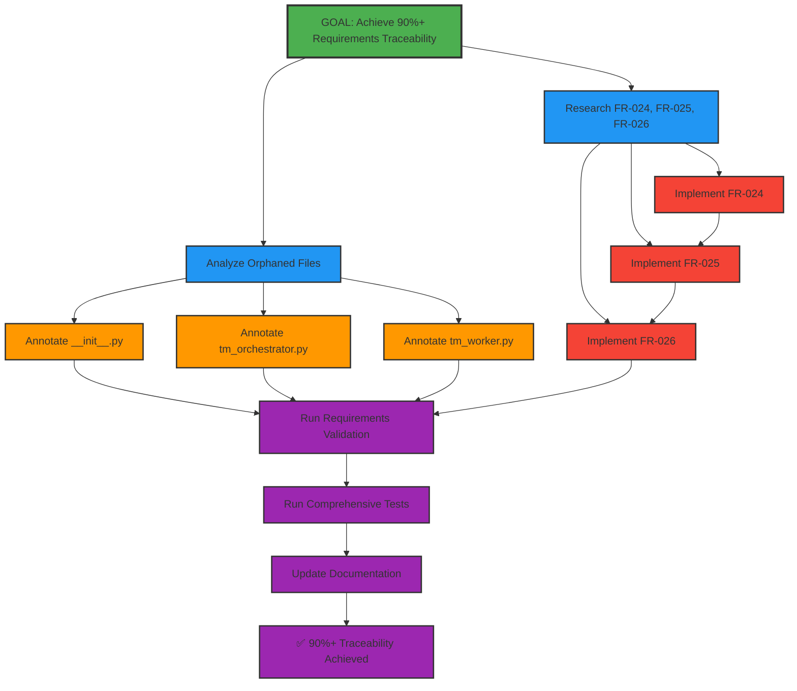

# Mikado Dependency Graph: Complete Requirements Traceability

## Current Discovery State

**PLANNED APPROACH**: This graph represents the systematic approach to achieve 90%+ requirements traceability through careful dependency analysis.

## Visual Representation

## Planned Execution Order

### Phase 1: Investigation (Parallel)
1. 🔵 **Research** - Examine requirement documents for FR-024, FR-025, FR-026
2. 🔵 **Analyze** - Map orphaned files to appropriate requirement categories

### Phase 2: Quick Wins (Sequential) 
3. 🟠 **Ann1** - Add @implements to __init__.py (simplest)
4. 🟠 **Ann2** - Add @implements to tm_orchestrator.py (moderate) 
5. 🟠 **Ann3** - Add @implements to tm_worker.py (moderate)

### Phase 3: Requirements Implementation (Sequential with Dependencies)
6. 🔴 **Impl1** - Implement FR-024 (foundation requirement)
7. 🔴 **Impl2** - Implement FR-025 (may depend on FR-024)
8. 🔴 **Impl3** - Implement FR-026 (may depend on FR-024, FR-025)

### Phase 4: Validation (Sequential)
9. 🟣 **Validate** - Run ./scripts/validate-requirements.sh (target: 90%+)
10. 🟣 **TestSuite** - Run ./tests/test_comprehensive.sh (ensure no regression)
11. 🟣 **UpdateDocs** - Document achievement in CLAUDE.md success patterns
12. ✅ **Complete** - 90%+ traceability achieved!

## Discovery Log

| Phase | What We Plan | Expected Outcome | Validation Method |
|-------|--------------|------------------|-------------------|
| 1 | Research missing requirements | Clear implementation plan | Requirements understood and documented |
| 2 | Add file annotations | Improve backward traceability | Files show "HAS REQUIREMENTS" in validation |
| 3 | Implement missing features | Achieve forward traceability | Requirements show "IMPLEMENTED" in validation |
| 4 | Final validation | Confirm 90%+ score | GREEN status from validation script |

## Node Status Legend

- 🎯 **Goal** (Green border) - Achieve 90%+ requirements traceability
- 🔵 **Phase 1** (Blue) - Investigation and analysis tasks  
- 🟠 **Phase 2** (Orange) - Quick wins through file annotations
- 🔴 **Phase 3** (Red) - Complex implementation tasks
- 🟣 **Phase 4** (Purple) - Validation and documentation
- ✅ **Completed** (Cyan) - Successfully implemented

## Critical Path Analysis

**Longest Path**: Research → Impl1 → Impl2 → Impl3 → Validate → TestSuite → UpdateDocs → Complete
- **Estimated Duration**: 10-13 hours
- **Risk Points**: Phase 3 implementations (complexity unknown until research complete)

## Parallel Work Opportunities

1. **Phase 1**: Research and Analysis can run in parallel
2. **Phase 2**: File annotations independent of each other after analysis
3. **Phase 3**: Implementation order may be flexible based on research findings

## Success Metrics Tracking

- **Current Baseline**: 78% (21/24 forward, 7/10 backward)  
- **Phase 2 Target**: ~83% (21/24 forward, 10/10 backward)
- **Final Target**: 90%+ (24/24 forward, 10/10 backward)

## Risk Mitigation Checkpoints

- **After Phase 1**: Confirm requirements are implementable with current architecture
- **After Phase 2**: Validate annotation improvements show in validation script
- **After each Phase 3 task**: Run validation to confirm progress toward goal
- **Before completion**: Full test suite pass confirms no regression