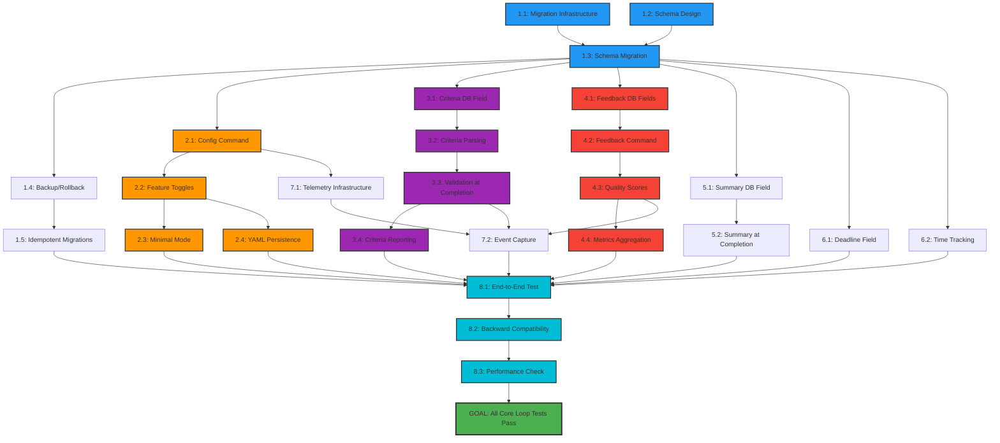

# Mikado Dependency Graph: Core Loop Enhancement Implementation

## Current Implementation State

**IMPORTANT**: This graph shows the PLANNED implementation dependencies based on our TDD test suite analysis.
As we implement, we'll discover actual blockers and update accordingly.

## Visual Representation

## Implementation Phases

### Phase 1: Foundation (Blue nodes)
**Critical Path - Must complete first**
- 1.1: Migration Infrastructure
- 1.2: Schema Design
- 1.3: Schema Migration
- 1.4: Backup/Rollback
- 1.5: Idempotent Migrations

### Phase 2: Parallel Branches (Can work simultaneously)

#### Configuration Branch (Orange nodes)
- 2.1: Config Command
- 2.2: Feature Toggles
- 2.3: Minimal Mode
- 2.4: YAML Persistence

#### Success Criteria Branch (Purple nodes)
- 3.1: Criteria DB Field
- 3.2: Criteria Parsing
- 3.3: Validation at Completion
- 3.4: Criteria Reporting

#### Feedback Branch (Red nodes)
- 4.1: Feedback DB Fields
- 4.2: Feedback Command
- 4.3: Quality Scores
- 4.4: Metrics Aggregation

### Phase 3: Integration (Cyan nodes)
**Requires all branches complete**
- 8.1: End-to-End Test
- 8.2: Backward Compatibility
- 8.3: Performance Check

## Critical Path Analysis

**Shortest path to value delivery:**
1. Migration Infrastructure (1.1) → 
2. Schema Design (1.2) → 
3. Schema Migration (1.3) → 
4. Success Criteria Field (3.1) → 
5. Criteria Parsing (3.2) → 
6. Criteria Validation (3.3)

This delivers the core value (success criteria) in 6 steps.

## Dependency Bottlenecks

**High Fan-Out Nodes** (many things depend on them):
- **Schema Migration (1.3)**: 6 direct dependencies
  - All feature branches require this
  - MUST be rock-solid before proceeding

**High Fan-In Nodes** (depend on many things):
- **Integration (8.1)**: 9 dependencies
  - Cannot start until all features complete
  - Natural synchronization point

## Risk Mitigation Through Dependencies

1. **Migration Safety**: Backup (1.4) before any schema changes
2. **Feature Isolation**: Config toggles (2.2) before features
3. **Progressive Enhancement**: Minimal mode (2.3) as escape hatch
4. **Validation Gates**: Each branch has tests before integration

## Update Log

| Date | Node | Status | Notes |
|------|------|--------|-------|
| 2025-08-20 | All | Planned | Initial dependency analysis from TDD tests |

## Node Status Legend

- 🎯 **Goal** (Green) - The main objective
- 🔵 **Foundation** (Blue) - Database and migration tasks
- 🟠 **Configuration** (Orange) - Feature management tasks
- 🟣 **Criteria** (Purple) - Success criteria tasks
- 🔴 **Feedback** (Red) - Quality feedback tasks
- 🔷 **Integration** (Cyan) - Final validation tasks
- ⚫ **Not Started** (Default) - Waiting to begin
- 🟡 **In Progress** (Yellow border) - Currently implementing
- ✅ **Completed** (Green fill) - Tests passing

## Next Steps

1. Start with Foundation Phase (blue nodes)
2. Run `./tests/test_core_loop_migration.sh` after each step
3. Update node colors as tasks complete
4. Document any discovered dependencies
5. Adjust graph if actual dependencies differ from plan