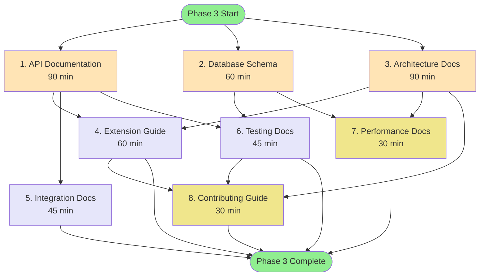

# Mikado Graph: Phase 3 - Developer Documentation

## Visual Dependency Graph



## Execution Phases

### Phase 3.1: Foundation (Parallel Start)
```
┌─────────────────────────────────────────┐
│  START                                   │
│    ├── [1] API Documentation (90 min)    │
│    ├── [2] Database Schema (60 min)      │
│    └── [3] Architecture Docs (90 min)    │
└─────────────────────────────────────────┘
```

### Phase 3.2: Extensions (After Foundation)
```
┌─────────────────────────────────────────┐
│  After 1,2,3 Complete                   │
│    ├── [4] Extension Guide (60 min)      │
│    ├── [5] Integration Docs (45 min)     │
│    └── [6] Testing Docs (45 min)         │
└─────────────────────────────────────────┘
```

### Phase 3.3: Polish (Final Tasks)
```
┌─────────────────────────────────────────┐
│  After 4,5,6 Complete                   │
│    ├── [7] Performance Docs (30 min)     │
│    └── [8] Contributing Guide (30 min)   │
└─────────────────────────────────────────┘
```

## Task Dependencies Table

| Task | Depends On | Enables | Priority | Time |
|------|------------|---------|----------|------|
| 1. API Documentation | None | 4,5,6 | HIGH | 90m |
| 2. Database Schema | None | 6,7 | HIGH | 60m |
| 3. Architecture | None | 4,7,8 | HIGH | 90m |
| 4. Extension Guide | 1,3 | 8 | MEDIUM | 60m |
| 5. Integration Docs | 1 | Complete | MEDIUM | 45m |
| 6. Testing Docs | 1,2 | 8 | MEDIUM | 45m |
| 7. Performance Docs | 2,3 | Complete | LOW | 30m |
| 8. Contributing Guide | 3,4,6 | Complete | LOW | 30m |

## Critical Path

The critical path (longest sequence) is:
```
Start → Architecture (90m) → Extension Guide (60m) → Contributing Guide (30m)
Total: 180 minutes (3 hours)
```

## Parallel Execution Opportunities

### Maximum Parallelization (3 developers)
- Developer 1: API Documentation → Extension Guide
- Developer 2: Database Schema → Testing Docs → Performance Docs
- Developer 3: Architecture → Integration Docs → Contributing Guide

### Two Developer Split
- Developer 1: API + Schema + Testing + Performance
- Developer 2: Architecture + Extension + Integration + Contributing

### Single Developer Optimal Order
1. Start all foundation docs (can reference between them)
2. Complete foundation in order: API, Schema, Architecture
3. Do extensions: Extension Guide, Integration, Testing
4. Finish with: Performance, Contributing

## Risk Areas

### High Risk
- **API Documentation**: Must be accurate, forms basis for extensions
- **Architecture**: Design decisions affect all other docs

### Medium Risk
- **Extension Guide**: Needs working examples
- **Testing Docs**: Must align with actual test suite

### Low Risk
- **Performance**: Can be updated based on real metrics
- **Contributing**: Can evolve with project

## Success Metrics

- [ ] Developer can implement custom validator in <30 minutes
- [ ] New contributor can understand architecture in <15 minutes
- [ ] All code examples execute without errors
- [ ] CI/CD integration works on first try
- [ ] Database schema diagram matches actual schema

## Notes

- Color coding:
  - 🟢 Green: Start/Complete nodes
  - 🟨 Yellow: Foundation documentation (Phase 3.1)
  - 🟪 Purple: Extension documentation (Phase 3.2)
  - 🟡 Gold: Polish documentation (Phase 3.3)

- Time estimates include:
  - Writing documentation
  - Creating examples
  - Testing examples
  - Review and revision