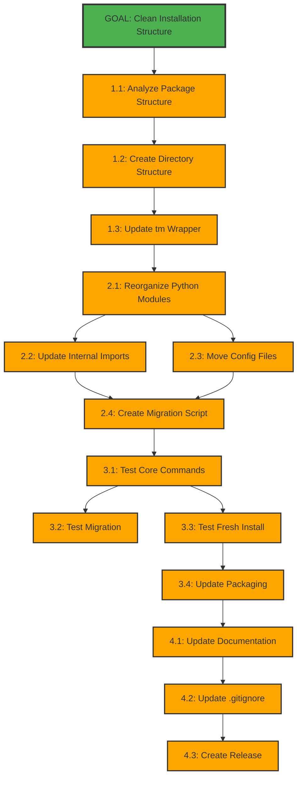

# Mikado Dependency Graph: Clean Installation Structure

## Current Discovery State

**IMPORTANT**: This graph shows the planned dependencies based on analysis. It will evolve as we discover actual blockers during implementation.

## Visual Representation

## Discovery Log

| Attempt # | What We Tried | What Blocked Us | Prerequisite Added | Status |
|-----------|--------------|-----------------|-------------------|---------|
| - | Planning phase | - | Initial dependencies mapped | Planned |

## Node Status Legend

- 🎯 **Goal** (Green border) - The main objective
- 🟠 **Planned** (Orange) - Dependencies identified through analysis
- 🟡 **Attempting** (Yellow) - Currently trying to implement
- 🟢 **Completed** (Cyan) - Successfully implemented
- 🔴 **Blocked** (Red) - Discovered blocker during implementation
- ⚫ **Reverted** (Gray dashed) - Attempted but reverted

## Critical Path Analysis

**Shortest path to completion:**
1. Analyze structure (1.1)
2. Create directories (1.2)
3. Update wrapper (1.3)
4. Reorganize modules (2.1)
5. Update imports (2.2)
6. Create migration (2.4)
7. Test commands (3.1)
8. Update packaging (3.4)
9. Create release (4.3)

**Parallel work opportunities:**
- Tasks 2.2 and 2.3 can be done in parallel after 2.1
- Tasks 3.2 and 3.3 can be done in parallel after 3.1
- Documentation (4.1, 4.2) can start early

## Mikado Process Tracking

- **Current Phase**: Planning Complete
- **Next Action**: Start Phase 1 - Analyze package structure
- **Green State**: Current working installation
- **Estimated Total Time**: 10.25 hours

## Update Instructions

1. Update node colors as tasks are attempted/completed
2. Add discovered dependencies if blockers found
3. Document attempts in Discovery Log
4. Mark completed tasks with cyan color
5. Update time estimates based on actual work