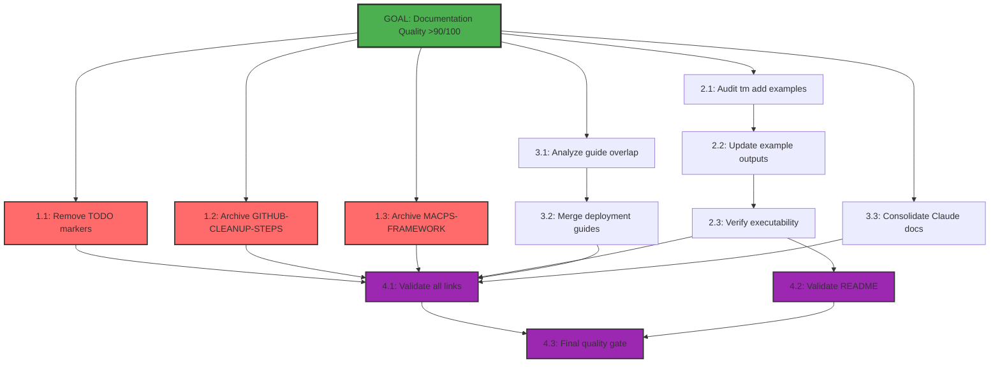

# Mikado Dependency Graph: Documentation LEAN Optimization

## Current Discovery State

**Planning Phase**: Dependencies identified through analysis of documentation quality gate report.

## Visual Representation

## Dependency Analysis

### Critical Path
The critical path to achieve >90/100 quality score:
1. Fix TODO markers (blocking API reference quality)
2. Update code examples (blocking user trust)
3. Validate all changes (ensuring no regressions)

### Parallel Work Opportunities
These tasks can be done simultaneously:
- Phase 1 tasks (1.1, 1.2, 1.3) - No interdependencies
- Claude consolidation (3.3) - Independent of other merges

### Sequential Requirements
These must be done in order:
- Example audit (2.1) → Fix examples (2.2) → Verify (2.3)
- Overlap analysis (3.1) → Merge guides (3.2)
- All fixes → Link validation (4.1) → Final gate (4.3)

## Node Status Legend

- 🎯 **Goal** (Green) - Main objective: >90/100 quality
- 🔴 **Critical** (Red) - Immediate issues blocking quality
- 🟡 **In Progress** (Yellow) - Currently being worked on
- 🟢 **Completed** (Cyan) - Successfully finished
- 🟣 **Validation** (Purple) - Quality checks and gates

## Execution Strategy

### Quick Wins First (Phase 1)
Start with critical issues that can be resolved quickly:
- Moving internal docs to archive (20 minutes total)
- Removing TODO markers (30 minutes)

### High Impact Next (Phase 2)
Fix code examples to restore user trust:
- Systematic audit and correction (2+ hours)
- Direct impact on user experience

### LEAN Optimization (Phase 3)
Eliminate waste through consolidation:
- Reduce maintenance burden
- Improve discoverability

### Validate Everything (Phase 4)
Ensure no regressions:
- Automated link checking
- Quality score validation

## Progress Tracking

- [ ] Phase 1: Critical Issues (0/3 tasks)
- [ ] Phase 2: Code Examples (0/3 tasks)
- [ ] Phase 3: LEAN Consolidation (0/3 tasks)
- [ ] Phase 4: Quality Validation (0/3 tasks)

**Total Progress**: 0/12 tasks (0%)