# Mikado Dependency Graph: Documentation Updates for Core Loop

## Current Discovery State

**Status**: Planning Complete - Ready for Execution

## Visual Representation

```mermaid
graph TD
    Goal[GOAL: Complete Documentation Updates]
    
    %% Phase 1: Critical Path
    Goal --> P1[Phase 1: Critical Path - 2-3 hours]
    P1 --> Task1_1[1.1 Update README.md]
    P1 --> Task1_2[1.2 Update CHANGELOG]
    P1 --> Task1_3[1.3 Create Migration Guide]
    P1 --> Task1_4[1.4 Create CLI Reference]
    P1 --> Task1_5[1.5 Update Quick Start]
    Task1_4 --> Task1_5
    
    %% Phase 2: User Documentation
    Goal --> P2[Phase 2: User Docs - 3-4 hours]
    P2 --> Task2_1[2.1 User Guide]
    P2 --> Task2_2[2.2 Config Guide]
    P2 --> Task2_3[2.3 Troubleshooting]
    P2 --> Task2_4[2.4 Metrics Guide]
    P2 --> Task2_5[2.5 Criteria Guide]
    Task1_4 --> Task2_1
    Task1_3 --> Task2_3
    Task1_4 --> Task2_3
    Task2_1 --> Task2_4
    Task2_1 --> Task2_5
    
    %% Phase 3: Developer Documentation
    Goal --> P3[Phase 3: Dev Docs - 4-5 hours]
    P3 --> Task3_1[3.1 Developer Guide]
    P3 --> Task3_2[3.2 API Reference]
    P3 --> Task3_3[3.3 Migration Module]
    P3 --> Task3_4[3.4 Config Module]
    P3 --> Task3_5[3.5 Telemetry Module]
    P3 --> Task3_6[3.6 Metrics Module]
    P3 --> Task3_7[3.7 Validator Module]
    P3 --> Task3_8[3.8 Error Module]
    Task1_3 --> Task3_3
    Task2_2 --> Task3_4
    Task2_4 --> Task3_6
    Task2_5 --> Task3_7
    
    %% Phase 4: Examples
    Goal --> P4[Phase 4: Examples - 2-3 hours]
    P4 --> Task4_1[4.1 Core Loop Examples]
    P4 --> Task4_2[4.2 Test Documentation]
    P4 --> Task4_3[4.3 Workflow Examples]
    P4 --> Task4_4[4.4 Contributing Guide]
    Task2_1 --> Task4_1
    Task4_1 --> Task4_3
    Task3_1 --> Task4_4
    
    %% Phase 5: Release
    Goal --> P5[Phase 5: Release - 1-2 hours]
    P5 --> Task5_1[5.1 Release Notes]
    P5 --> Task5_2[5.2 PRD Status]
    P5 --> Task5_3[5.3 FAQ]
    P1 --> Task5_1
    P2 --> Task5_1
    P3 --> Task5_1
    P4 --> Task5_1
    Task5_1 --> Task5_2
    Task2_3 --> Task5_3
    
    classDef goal fill:#4CAF50,stroke:#333,stroke-width:3px;
    classDef phase fill:#2196F3,stroke:#333,stroke-width:2px;
    classDef critical fill:#ff6b6b,stroke:#333,stroke-width:2px;
    classDef user fill:#feca57,stroke:#333,stroke-width:2px;
    classDef dev fill:#48dbfb,stroke:#333,stroke-width:2px;
    classDef example fill:#ff9ff3,stroke:#333,stroke-width:2px;
    classDef release fill:#00d2d3,stroke:#333,stroke-width:2px;
    
    class Goal goal;
    class P1,P2,P3,P4,P5 phase;
    class Task1_1,Task1_2,Task1_3,Task1_4,Task1_5 critical;
    class Task2_1,Task2_2,Task2_3,Task2_4,Task2_5 user;
    class Task3_1,Task3_2,Task3_3,Task3_4,Task3_5,Task3_6,Task3_7,Task3_8 dev;
    class Task4_1,Task4_2,Task4_3,Task4_4 example;
    class Task5_1,Task5_2,Task5_3 release;
```



## Dependency Analysis

### Critical Dependencies (Must Complete First)
1. **Task 1.4 (CLI Reference)** → Blocks 5 other tasks
2. **Task 1.3 (Migration Guide)** → Blocks safe user migration
3. **Task 2.1 (User Guide)** → Blocks 3 example tasks

### Parallel Execution Opportunities
- Phase 1 tasks (1.1, 1.2, 1.3, 1.4) can be done in parallel
- Phase 2 and Phase 3 can be executed simultaneously
- Module documentation (3.3-3.8) can be done in parallel

### Critical Path
```
1.4 CLI Reference → 1.5 Quick Start → 2.1 User Guide → 4.1 Examples → 5.1 Release Notes
```
Total critical path: ~4.5 hours

## Node Status Legend

- 🎯 **Goal** (Green) - Main objective
- 📘 **Phase** (Blue) - Major phase grouping
- 🔴 **Critical** (Red) - Phase 1 critical path tasks
- 🟡 **User** (Yellow) - User documentation tasks
- 🔵 **Dev** (Cyan) - Developer documentation tasks
- 🟣 **Example** (Pink) - Example and test docs
- 🟢 **Release** (Teal) - Release documentation

## Execution Strategy

### Recommended Execution Order

1. **Critical Path First** (Phase 1)
   - These 5 tasks unblock everything else
   - Can be completed in 2-3 hours
   - Enables basic user adoption

2. **Parallel User/Dev Docs** (Phases 2 & 3)
   - Split effort if multiple people available
   - User docs have higher priority
   - Dev docs can lag slightly

3. **Examples Validate Understanding** (Phase 4)
   - Creates concrete usage patterns
   - Tests documentation accuracy
   - Provides copy-paste solutions

4. **Release Finalization** (Phase 5)
   - Synthesizes all documentation
   - Creates cohesive announcement
   - Marks completion

## Progress Tracking

| Phase | Tasks | Completed | Progress |
|-------|-------|-----------|----------|
| Phase 1 | 5 | 0 | ░░░░░░░░░░ 0% |
| Phase 2 | 5 | 0 | ░░░░░░░░░░ 0% |
| Phase 3 | 8 | 0 | ░░░░░░░░░░ 0% |
| Phase 4 | 4 | 0 | ░░░░░░░░░░ 0% |
| Phase 5 | 3 | 0 | ░░░░░░░░░░ 0% |
| **Total** | **25** | **0** | **░░░░░░░░░░ 0%** |

## Risk Mitigation Through Dependencies

The dependency structure ensures:
1. **No user attempts migration without guide** (1.3 first)
2. **No examples reference undocumented commands** (1.4 before examples)
3. **No release without complete documentation** (5.1 depends on all)
4. **No confusion from inconsistent information** (phased approach)

## Update Instructions

As tasks are completed:
1. Update task node color to green (completed)
2. Update progress bars above
3. Note any discovered dependencies
4. Document any deviations from plan
5. Mark completion time for metrics