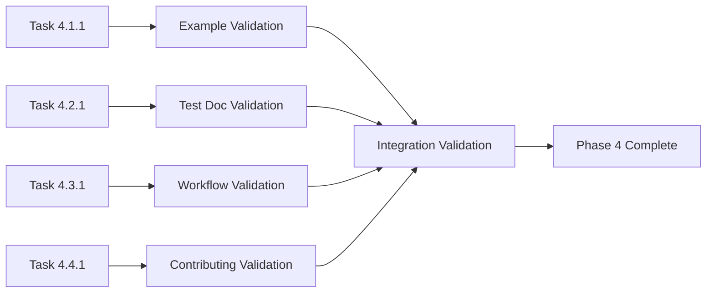

# Mikado Dependency Graph: Examples and Testing Documentation (Phase 4)

## Visual Dependency Structure

```mermaid
graph TD
    %% Phase Dependencies
    P3[Phase 3: Developer Documentation ✅] --> P4[Phase 4: Examples and Testing]
    
    %% Phase 4 Tasks
    P4 --> T411[Task 4.1.1: Core Loop Examples]
    P4 --> T421[Task 4.2.1: Test Documentation]
    
    T411 --> T431[Task 4.3.1: Workflow Examples]
    T421 --> T441[Task 4.4.1: Contributing Guide]
    
    %% Task Details
    T411 --> EX1[Feature Demonstrations]
    T411 --> EX2[Integration Examples]
    T411 --> EX3[Error Handling Examples]
    
    T421 --> TD1[Test Architecture Overview]
    T421 --> TD2[Test Execution Guide]
    T421 --> TD3[Test Development Guide]
    
    T431 --> WF1[Team Collaboration Workflows]
    T431 --> WF2[Quality Assurance Workflows]
    T431 --> WF3[Automation Workflows]
    
    T441 --> CG1[Core Loop Development Process]
    T441 --> CG2[Code Quality Standards]
    
    %% Deliverables
    EX1 --> DEL1[/docs/examples/core-loop-examples.md]
    EX2 --> DEL1
    EX3 --> DEL1
    
    TD1 --> DEL2[/tests/README-CORE-LOOP-TESTS.md]
    TD2 --> DEL2
    TD3 --> DEL2
    
    WF1 --> DEL3[/docs/examples/workflows/]
    WF2 --> DEL3
    WF3 --> DEL3
    
    CG1 --> DEL4[/CONTRIBUTING.md]
    CG2 --> DEL4
    
    %% Styling
    classDef completed fill:#90EE90,stroke:#006400,stroke-width:2px
    classDef inProgress fill:#FFE4B5,stroke:#FF8C00,stroke-width:2px
    classDef pending fill:#F0F8FF,stroke:#4169E1,stroke-width:2px
    classDef deliverable fill:#E6E6FA,stroke:#8A2BE2,stroke-width:2px
    
    class P3 completed
    class P4,T411,T421,T431,T441 pending
    class EX1,EX2,EX3,TD1,TD2,TD3,WF1,WF2,WF3,CG1,CG2 pending
    class DEL1,DEL2,DEL3,DEL4 deliverable
```

## Critical Path Analysis

### Primary Path (Sequential)
```
Phase 3 ✅ → Task 4.1.1 → Task 4.3.1 → Phase 4 Complete
Duration: 45 + 45 = 90 minutes
```

### Secondary Path (Parallel)
```
Phase 3 ✅ → Task 4.2.1 → Task 4.4.1 → Phase 4 Complete
Duration: 30 + 30 = 60 minutes
```

**Critical Path**: Primary Path (90 minutes)
**Total Phase Duration**: 90 minutes (with parallel execution)
**Sequential Duration**: 150 minutes (if done sequentially)

## Parallel Execution Opportunities

### High Parallelization Potential
- **Task 4.1.1** and **Task 4.2.1** can be executed simultaneously
  - No dependencies between them
  - Different focus areas (examples vs. test documentation)
  - Different deliverable locations

### Medium Parallelization Potential
- **Task 4.3.1** and **Task 4.4.1** have soft dependencies
  - Task 4.3.1 builds on examples from Task 4.1.1
  - Task 4.4.1 references test procedures from Task 4.2.1
  - Can be started in parallel with coordination

## Task Dependency Details

### Task 4.1.1: Core Loop Examples
**Dependencies**: 
- Phase 3 completion (API documentation, architecture understanding)

**Enables**:
- Task 4.3.1 (uses examples as foundation for workflows)

**Duration**: 45 minutes
**Risk Level**: Medium (examples must be tested and accurate)

### Task 4.2.1: Test Documentation  
**Dependencies**: 
- None (independent documentation task)

**Enables**:
- Task 4.4.1 (testing requirements in contributing guide)

**Duration**: 30 minutes
**Risk Level**: Low (documentation of existing test structure)

### Task 4.3.1: Workflow Examples
**Dependencies**:
- Task 4.1.1 (builds on Core Loop examples)

**Enables**:
- Phase 4 completion (major deliverable)

**Duration**: 45 minutes
**Risk Level**: Medium (workflow complexity and real-world applicability)

### Task 4.4.1: Contributing Guide Updates
**Dependencies**:
- Task 4.2.1 (test procedures for contribution requirements)

**Enables**:
- Phase 4 completion

**Duration**: 30 minutes
**Risk Level**: Low (updates to existing document)

## Resource Allocation Strategy

### Optimal Execution Plan
```
Time Slot 1 (0-45 min):  Task 4.1.1 + Task 4.2.1 (Parallel)
Time Slot 2 (45-75 min): Task 4.3.1 + Task 4.4.1 (Parallel with coordination)
Time Slot 3 (75-90 min): Validation and integration
```

### Resource Requirements
- **Single Developer**: 150 minutes sequential, 90 minutes with task switching
- **Two Developers**: 60 minutes with optimal parallel execution
- **Validation Environment**: Clean testing environment required

## Risk Mitigation in Dependencies

### Task 4.1.1 Risks
- **Risk**: Examples become outdated quickly
- **Mitigation**: Generate from actual implementation where possible
- **Fallback**: Clear versioning and update procedures

### Task 4.3.1 Dependency Risk
- **Risk**: Workflow examples depend on Task 4.1.1 examples
- **Mitigation**: Define example interface early, allow parallel development
- **Fallback**: Basic workflows can be created without complete examples

### Integration Risks
- **Risk**: Inconsistencies between tasks
- **Mitigation**: Regular coordination points during parallel execution
- **Fallback**: Final integration review to align deliverables

## Validation Dependencies

### Cross-Task Validation


### Validation Sequence
1. **Individual Task Validation** (10 minutes each)
2. **Cross-Reference Validation** (10 minutes)
3. **Integration Validation** (15 minutes)
4. **Final Quality Check** (5 minutes)

## Milestone Dependencies

### Milestone 1: Foundation Complete
- Task 4.1.1 and 4.2.1 completed
- Basic examples and test documentation available
- Foundation for dependent tasks established

### Milestone 2: Extension Complete  
- Task 4.3.1 and 4.4.1 completed
- Workflow examples and contributing guidelines finished
- All deliverables created

### Milestone 3: Phase 4 Complete
- All validation completed
- Integration verified
- Ready for Phase 5 handoff

## Blocking Conditions

### Hard Blocks (Must Resolve)
- Phase 3 incomplete
- Core Loop implementation unstable
- Testing environment unavailable

### Soft Blocks (Can Work Around)
- Incomplete API documentation (use code directly)
- Missing some test files (document known structure)
- Unclear workflows (create basic patterns first)

## Optimization Opportunities

### Time Optimization
- **Parallel Execution**: Reduce total time by 40%
- **Template Reuse**: Standard formats across deliverables
- **Automated Validation**: Scripts for example testing

### Quality Optimization
- **Cross-Task Reviews**: Each task reviewer looks at related tasks
- **Integrated Testing**: Examples tested with workflows
- **Consistent Terminology**: Shared glossary across deliverables

---

## Implementation Notes

### Start Conditions
- Phase 3 completed ✅
- Core Loop implementation stable
- Clean testing environment available
- Documentation templates prepared

### Success Conditions
- All examples tested and working
- Documentation enables user success
- Contributing process facilitates development
- Quality standards maintained throughout

### Handoff Conditions
- Phase 4 deliverables complete
- Validation passed
- Ready for Phase 5: Release Documentation