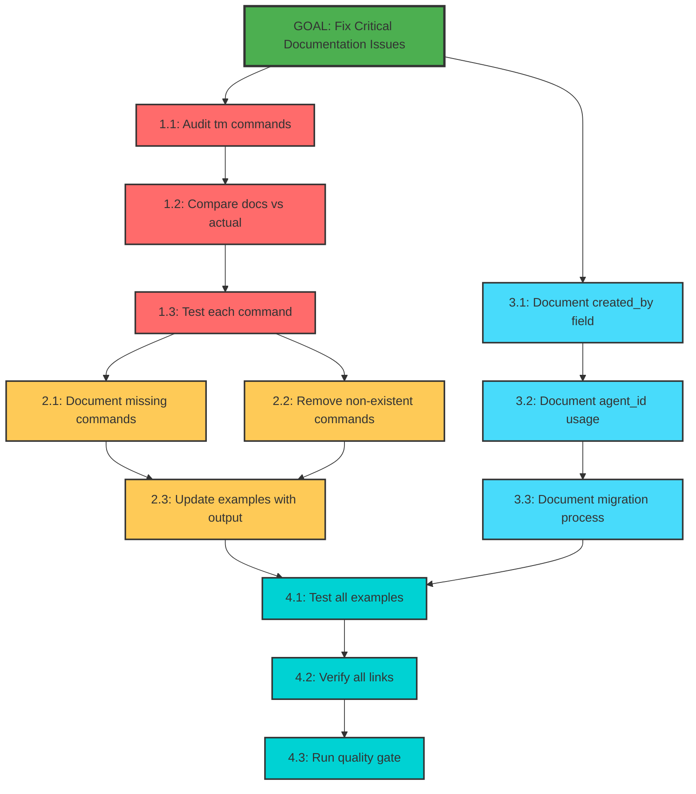

# Mikado Dependency Graph: Fix Documentation Critical Issues

## Current Discovery State

**Status**: Planning Phase - Dependencies identified through analysis

## Visual Representation

## Dependency Analysis

### Critical Path
1. Audit commands → Compare → Test → Fix CLI docs → Update examples → Test all → Quality gate
   - **Duration**: ~5 hours
   - **Blocking**: Cannot document what we don't understand

### Parallel Work Possible
- API documentation (Phase 3) can proceed independently
- Link verification can start once any documentation is updated

### Key Dependencies Identified

| Component | Depends On | Reason |
|-----------|------------|--------|
| CLI Documentation | tm script audit | Must know what actually exists |
| Example Updates | Command documentation | Examples must match documented commands |
| Quality Gate | All documentation updates | Final validation of all changes |
| Migration Docs | created_by field docs | Must explain new field first |

## Node Status Legend

- 🎯 **Goal** (Green) - Main objective
- 🔴 **Phase 1** (Red) - Discovery/Audit tasks
- 🟡 **Phase 2** (Yellow) - CLI documentation fixes
- 🔵 **Phase 3** (Light Blue) - API documentation updates
- 🟢 **Phase 4** (Cyan) - Validation tasks

## Execution Strategy

1. **Start with parallel paths**:
   - Path A: Command audit (Phase 1)
   - Path B: API documentation (Phase 3)

2. **Converge at Phase 2**: Use audit results to fix CLI docs

3. **Final validation**: All paths complete before quality gate

## Risk Mitigation Through Dependencies

- Testing commands before documenting prevents documenting broken features
- Comparing before fixing prevents unnecessary work
- Running quality gate last ensures all issues addressed

## Update Instructions

As tasks are completed:
1. Mark nodes as completed (change to green fill)
2. Update status in implementation guide
3. Document any new dependencies discovered
4. Note actual time vs estimated time