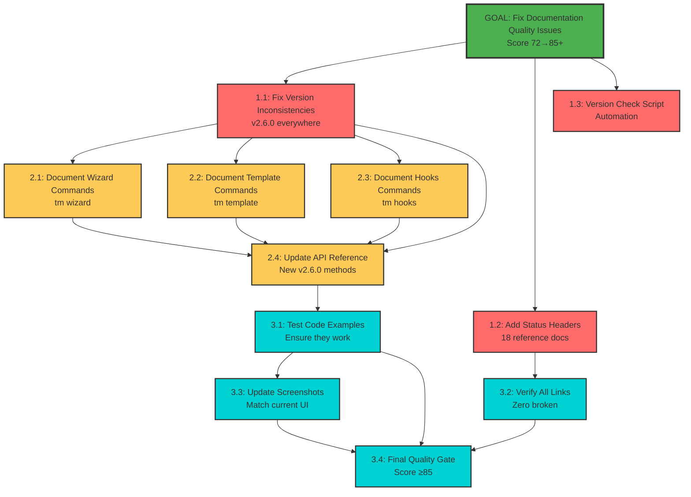

# Mikado Dependency Graph: Fix Documentation Quality Issues

## Current Dependency State

This graph shows the discovered dependencies for fixing documentation quality issues.

## Visual Representation

## Dependency Analysis

| Phase | Tasks | Dependencies | Critical Path |
|-------|-------|--------------|---------------|
| 1 | Version fixes, Status headers, Script | None (can parallelize) | Version fix is critical |
| 2 | Document new commands | Requires version fix | API update depends on all |
| 3 | Validation & testing | Requires documentation | Quality check is final gate |

## Node Status Legend

- 🎯 **Goal** (Green) - Main objective: Quality score 85+
- 🔴 **Critical** (Red) - Must fix immediately (version, status)
- 🟡 **Updates** (Yellow) - Documentation additions
- 🟢 **Validation** (Cyan) - Testing and verification
- ✅ **Completed** (Cyan fill) - Task done and validated

## Critical Path

The critical path to achieve quality score 85+:
1. Fix version inconsistencies (blocks all updates)
2. Update API reference (depends on all command docs)
3. Test code examples (validates documentation)
4. Run quality gate check (final validation)

## Parallel Opportunities

These tasks can be done in parallel:
- Tasks 1.1, 1.2, 1.3 (all Phase 1)
- Tasks 2.1, 2.2, 2.3 (after version fix)
- Tasks 3.1, 3.2 (validation tasks)

## Update Instructions

1. Mark tasks completed as work progresses
2. Update node colors in graph
3. Document any new dependencies discovered
4. Track actual vs estimated time
5. Note any deviations from plan