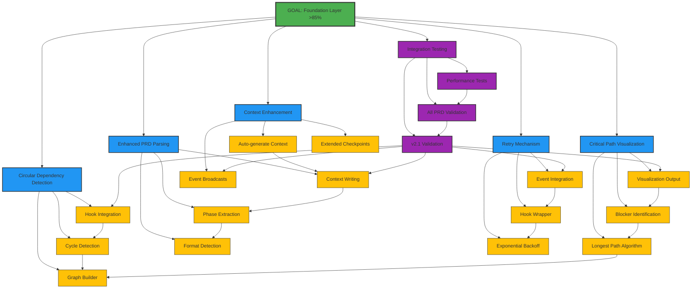

# Mikado Dependency Graph: Foundation Layer Completion

## Current Discovery State

**Goal**: Complete Foundation Layer Implementation (v2.1 gaps from 56% to >85%)

## Visual Representation

## Dependency Analysis

### Critical Path
The longest dependency chain is:
1. Graph Builder (CD1)
2. Cycle Detection (CD2) 
3. Hook Integration (CD3)
4. v2.1 Validation (T1)
5. All PRD Validation (T2)
6. Performance Tests (T3)

**Estimated Duration**: 6 sequential steps, ~8 hours on critical path

### Parallel Work Opportunities
These can be done in parallel:
- Circular Dependencies (CD branch)
- PRD Parsing (PRD branch)
- Retry Mechanism (RM branch)
- Context Enhancement (CE2, CE3)

### Blocking Dependencies
- **CD1 (Graph Builder)** blocks both CD2 and CP1
- **PRD3 (Context Writing)** blocks CE1
- **All Phase 1-5 completions** block Integration Testing

## Implementation Priority

1. **Start with leaves** (no dependencies):
   - CD1: Graph Builder
   - PRD1: Format Detection
   - RM1: Exponential Backoff
   - CE2: Extended Checkpoints
   - CE3: Event Broadcasts

2. **Then proceed to**:
   - CD2: Cycle Detection (needs CD1)
   - CP1: Longest Path (needs CD1)
   - PRD2: Phase Extraction (needs PRD1)
   - RM2: Hook Wrapper (needs RM1)

3. **Integration layer**:
   - CD3, CP3, PRD3, RM3, CE1

4. **Final validation**:
   - T1, T2, T3 in sequence

## Node Status Legend

- 🎯 **Goal** (Green) - Main objective
- 📘 **Phase** (Blue) - Major component
- 📝 **Task** (Yellow) - Implementation task
- 🧪 **Testing** (Purple) - Validation task
- ✅ **Completed** (Cyan) - Done
- ⏸️ **Blocked** - Waiting on dependency
- 🔄 **In Progress** - Currently working

## Progress Tracking

- **Phase 1**: ⬜⬜⬜ 0% (0/3 tasks)
- **Phase 2**: ⬜⬜⬜ 0% (0/3 tasks)
- **Phase 3**: ⬜⬜⬜ 0% (0/3 tasks)
- **Phase 4**: ⬜⬜⬜ 0% (0/3 tasks)
- **Phase 5**: ⬜⬜⬜ 0% (0/3 tasks)
- **Phase 6**: ⬜⬜⬜ 0% (0/3 tasks)

**Overall**: 0/18 tasks (0%)