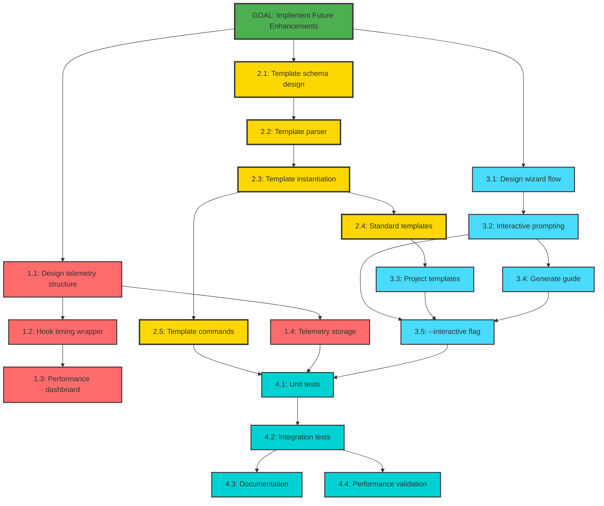

# Mikado Dependency Graph: Implement Future Enhancements

## Current Discovery State

**Status**: Planning Phase - Starting with highest-value feature (Templates)

## Visual Representation

## Implementation Strategy

### Priority Path (Templates First)
1. **Start Here**: Task 2.1 - Design template schema
2. **Critical Path**: Schema → Parser → Instantiation → Commands
3. **Enables**: Wizard project types, team workflows

### Parallel Work Opportunities
- **Track A**: Templates (2.1-2.5) - 7 hours
- **Track B**: Monitoring (1.1-1.4) - 7 hours
- **Track C**: Wizard (3.1-3.2) - 3 hours initially

### Key Dependencies
| Component | Depends On | Reason |
|-----------|------------|--------|
| Wizard Project Types | Template Library | Reuses template system |
| Template Commands | Template Parser | Need parser to load templates |
| Performance Dashboard | Hook Wrapper | Need timing data to display |
| Interactive Flag | All wizard components | Full wizard needed |

## Execution Order (Optimized)

### Sprint 1: Templates (Highest Value)
1. Design template schema (1h)
2. Implement parser (2h)
3. Build instantiation (2h)
4. Create library (1h)
5. Add commands (1h)
**Total**: 7 hours → Immediate user value

### Sprint 2: Wizard (Better Onboarding)
1. Design flow (1h)
2. Build prompting (2h)
3. Create project types (1h)
4. Generate guides (1h)
5. Add --interactive (1h)
**Total**: 6 hours → Improved new user experience

### Sprint 3: Monitoring (Developer Tools)
1. Design telemetry (1h)
2. Add timing wrapper (2h)
3. Build dashboard (2h)
4. Implement storage (1h)
**Total**: 6 hours → Better observability

### Sprint 4: Quality Assurance
1. Unit tests (3h)
2. Integration tests (2h)
3. Documentation (2h)
4. Performance check (1h)
**Total**: 8 hours → Production ready

## Node Status Legend

- 🎯 **Goal** (Green) - Main objective
- ⭐ **Priority** (Gold) - Start here for maximum value
- 🔴 **Monitoring** (Red) - Performance features
- 🟡 **Templates** (Yellow) - Workflow features
- 🔵 **Wizard** (Light Blue) - Onboarding features
- 🟢 **Testing** (Cyan) - Quality assurance

## Risk Mitigation

1. **Templates Too Complex**: Start with minimal schema, expand based on usage
2. **Performance Overhead**: Make monitoring sampling-based, not every execution
3. **Wizard Annoyance**: Default to non-interactive, require explicit flag

## Success Metrics

- Templates reduce task creation time by 50%
- Wizard gets new users productive in <2 minutes
- Hook monitoring identifies performance issues before users notice
- All features have <5% impact on existing performance