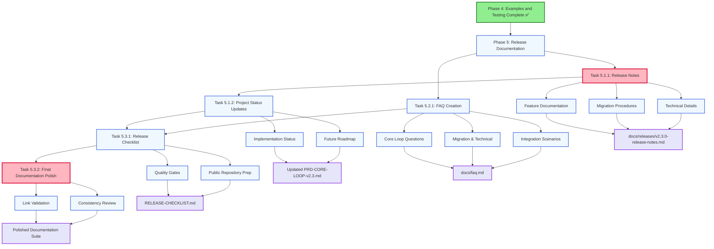
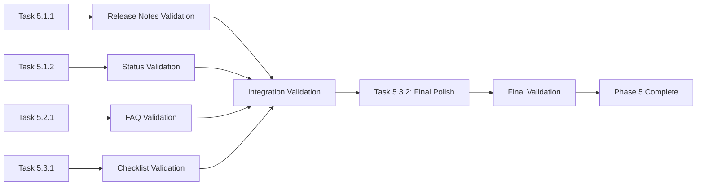

# Mikado Dependency Graph: Release Documentation (Phase 5)

## Visual Dependency Structure



## Critical Path Analysis

### Primary Path (Sequential - Critical)
```
Phase 4 ✅ → Task 5.1.1 → Task 5.1.2 → Task 5.3.1 → Task 5.3.2 → Phase 5 Complete
Duration: 30 + 15 + 15 + 15 = 75 minutes
```

### Secondary Path (Parallel Opportunity)
```
Phase 4 ✅ → Task 5.2.1 → Task 5.3.1 → Task 5.3.2 → Phase 5 Complete
Duration: 30 + 15 + 15 = 60 minutes
```

**Critical Path**: Primary Path (75 minutes)
**Total Phase Duration**: 75 minutes (with optimal parallel execution)
**Sequential Duration**: 105 minutes (if done sequentially)

## Parallel Execution Opportunities

### High Parallelization Potential
- **Task 5.1.2** and **Task 5.2.1** can be executed simultaneously
  - No dependencies between project status updates and FAQ creation
  - Different focus areas and deliverable locations
  - Both feed into Task 5.3.1 but don't depend on each other

### Medium Parallelization Potential
- **Task 5.1.1** must complete before other tasks
  - Provides foundation for project status updates
  - Critical for establishing release scope and content
  - All subsequent tasks reference release notes content

## Task Dependency Details

### Task 5.1.1: Release Notes (CRITICAL)
**Dependencies**: 
- Phase 4 completion (all examples and testing documentation available)

**Enables**:
- Task 5.1.2 (project status updates reference release content)
- Provides foundation for all subsequent tasks

**Duration**: 30 minutes
**Risk Level**: High (foundation for entire phase)
**Critical Nature**: All other tasks depend on accurate release notes

### Task 5.1.2: Project Status Updates
**Dependencies**:
- Task 5.1.1 (release notes provide implementation verification)

**Enables**:
- Task 5.3.1 (status updates inform release readiness)

**Duration**: 15 minutes
**Risk Level**: Low (straightforward status documentation)

### Task 5.2.1: FAQ Creation  
**Dependencies**: 
- None (independent knowledge gathering and documentation)

**Enables**:
- Task 5.3.1 (FAQ completeness affects release readiness)

**Duration**: 30 minutes
**Risk Level**: Medium (requires anticipating user questions accurately)

### Task 5.3.1: Release Validation Checklist
**Dependencies**:
- Task 5.1.2 (project status informs readiness criteria)
- Task 5.2.1 (FAQ completeness affects user readiness)

**Enables**:
- Task 5.3.2 (checklist guides final polish procedures)

**Duration**: 15 minutes
**Risk Level**: Medium (must capture all quality requirements)

### Task 5.3.2: Final Documentation Polish (CRITICAL)
**Dependencies**:
- Task 5.3.1 (checklist guides polish procedures)
- All previous tasks (polish applies to all deliverables)

**Enables**:
- Phase 5 completion and v2.3 release readiness

**Duration**: 15 minutes
**Risk Level**: High (final quality gate before release)
**Critical Nature**: Determines public presentation quality

## Resource Allocation Strategy

### Optimal Execution Plan
```
Time Slot 1 (0-30 min):  Task 5.1.1 (Release Notes) [Critical Start]
Time Slot 2 (30-45 min): Task 5.1.2 (Project Status) + Task 5.2.1 Start [Parallel]
Time Slot 3 (45-60 min): Task 5.2.1 Continue [FAQ Completion]
Time Slot 4 (60-75 min): Task 5.3.1 + Task 5.3.2 [Final Quality Gates]
```

### Resource Requirements
- **Single Developer**: 105 minutes sequential, 75 minutes with task switching
- **Two Developers**: 60 minutes with optimal parallel execution
- **Clean Environment**: Required for example validation and link testing

## Risk Mitigation in Dependencies

### Task 5.1.1 Critical Risk
- **Risk**: Incomplete or inaccurate release notes block entire phase
- **Mitigation**: Use Phase 3-4 deliverables as comprehensive checklist
- **Fallback**: Staged release notes creation with incremental validation

### Task 5.2.1 Independence Advantage
- **Benefit**: FAQ creation can proceed independently if release notes delayed
- **Strategy**: Start FAQ in parallel to maintain timeline
- **Coordination**: Regular check-ins to ensure consistency with release notes

### Final Quality Gate Risk
- **Risk**: Task 5.3.2 discovers quality issues requiring rework
- **Mitigation**: Continuous quality checks throughout Phase 5
- **Fallback**: Dedicated time buffer for addressing discovered issues

## Validation Dependencies

### Cross-Task Validation


### Validation Sequence
1. **Individual Task Validation** (5 minutes each)
2. **Cross-Reference Validation** (consistency check)
3. **Integration Validation** (comprehensive review)
4. **Final Quality Validation** (public readiness check)

## Milestone Dependencies

### Milestone 1: Foundation Complete
- Task 5.1.1 completed with comprehensive release notes
- Release scope and content established
- Foundation for all subsequent documentation

### Milestone 2: Content Complete  
- Task 5.1.2 and 5.2.1 completed
- All content deliverables finished
- Ready for quality assurance phase

### Milestone 3: Phase 5 Complete
- All validation completed
- Documentation polished and public-ready
- v2.3 release documentation complete

## Blocking Conditions

### Hard Blocks (Must Resolve)
- Phase 4 incomplete or deliverables missing
- Core Loop implementation unstable or untested
- No access to clean environment for validation

### Soft Blocks (Can Work Around)
- Some Phase 3-4 content gaps (can be filled during Phase 5)
- Minor quality issues (can be addressed in final polish)
- Limited testing environment (can use alternative validation methods)

## Optimization Opportunities

### Time Optimization
- **Parallel Execution**: Reduce total time by 30%
- **Template Reuse**: Standard formats from Phase 3-4
- **Automated Validation**: Scripts for link checking and example testing

### Quality Optimization
- **Continuous Validation**: Quality checks throughout phase
- **Staged Reviews**: Progressive quality improvements
- **User Perspective**: Always validate from user viewpoint

### Risk Optimization
- **Early Quality Gates**: Catch issues before final polish
- **Incremental Validation**: Validate as you go
- **Fallback Procedures**: Ready alternatives for critical issues

---

## Implementation Notes

### Start Conditions
- Phase 4 completed ✅
- All Core Loop features implemented and tested
- Clean testing environment available
- Quality standards and templates established

### Success Conditions
- Release notes comprehensive and accurate
- FAQ addresses common user concerns
- Documentation meets professional publication standards
- All quality gates passed
- Public repository ready for v2.3 release

### Handoff Conditions
- Phase 5 deliverables complete and validated
- Release checklist ready for execution
- Community engagement pathways established
- Task Orchestrator v2.3 ready for public launch