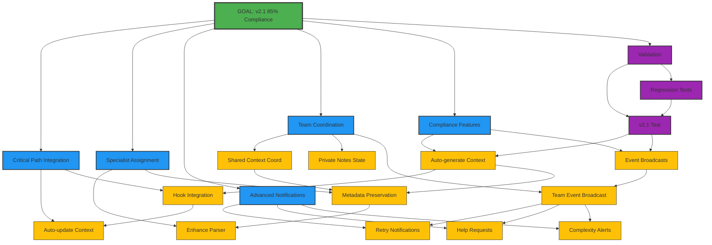

# Mikado Dependency Graph: Complete v2.1 Requirements to 85%

## Current Discovery State

**Goal**: Achieve 85% v2.1 compliance (from current 65%)

## Visual Representation

## Dependency Analysis

### Critical Dependencies
1. **CP1 (Auto-update Context)** - Blocks CP2 and later COMP1
2. **SA2 (Metadata Preservation)** - Blocks TC1 and COMP1
3. **AN1-3 (Notifications)** - All block TC3
4. **COMP1 & COMP2** - Block final validation

### Parallel Work Opportunities
- Phase 1 (CP1) can run parallel with Phase 2 (SA1)
- All Phase 3 tasks (AN1, AN2, AN3) can run in parallel
- TC2 can run independently

### Estimated Critical Path
CP1 → CP2 → COMP1 → VAL1 → VAL2 (4 hours)

## Node Status Legend

- 🎯 **Goal** (Green) - Main objective
- 📘 **Phase** (Blue) - Major component group
- 📝 **Task** (Yellow) - Implementation task
- 🧪 **Validation** (Purple) - Testing task
- ✅ **Completed** (Cyan) - Done
- 🔄 **In Progress** (Orange) - Currently working
- ⏸️ **Blocked** (Red) - Waiting on dependency

## Progress Tracking

- **Phase 1**: ⬜⬜ 0% (0/2 tasks)
- **Phase 2**: ⬜⬜ 0% (0/2 tasks)
- **Phase 3**: ⬜⬜⬜ 0% (0/3 tasks)
- **Phase 4**: ⬜⬜⬜ 0% (0/3 tasks)
- **Phase 5**: ⬜⬜ 0% (0/2 tasks)
- **Phase 6**: ⬜⬜ 0% (0/2 tasks)

**Overall**: 0/14 tasks (0%)