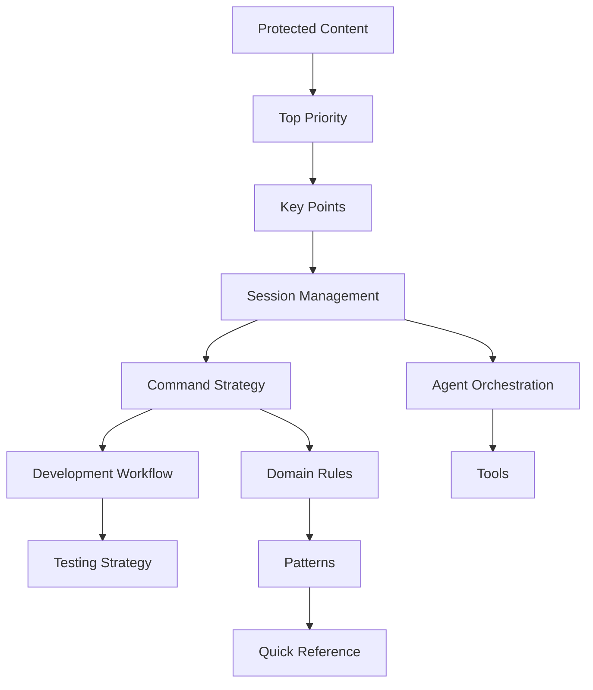

# CLAUDE.md Optimal Structure Template for New Projects

## The Ultimate Guide to Organizing Your CLAUDE.md for Maximum Effectiveness

This template provides the ideal structure for organizing instructions in CLAUDE.md to enable optimal AI assistance.

```markdown
# CLAUDE.md - Your AI Dev Team Partner

[Brief description of what this file does - 1-2 lines]

## 📑 Table of Contents
[Optional but helpful for large CLAUDE.md files >500 lines]

1. [Protected Content Notice](#protected-content-notice)
2. [Absolute Top Priority](#absolute-top-priority)
3. [Key Points](#key-points)
4. [Session Management](#session-management)
5. [Project Architecture](#project-architecture)
6. [Command Strategy](#command-strategy)
7. [Development Workflow](#development-workflow)
8. [Testing Strategy](#testing-strategy)
9. [Agent Orchestration](#agent-orchestration)
10. [Tools & Infrastructure](#tools-infrastructure)
11. [Domain-Specific Rules](#domain-specific)
12. [Patterns & Anti-Patterns](#patterns)
13. [Quick Reference](#quick-reference)
14. [Appendices](#appendices)

---

## ⚠️ Protected Content Notice
[ALWAYS FIRST - Immediately visible, sets protection expectations]

**CRITICAL**: [X] Protected Rules with proven [metrics]. These MUST NOT be modified.

**Quick Reference**: Rules [X-Y] are protected operational standards
**Details**: Look for [PROTECTED] markers inline

---

## 🎯 Absolute Top Priority
[THE ONE RULE - What matters most in this project]

**[YOUR #1 PRINCIPLE IN CAPS]** - [Clear, memorable statement]

Example:
**REQUIREMENTS SHALL ALWAYS COME FIRST** - Every action begins with understanding and aligning to requirements.

---

## 📌 Key Points I Should Always Remember
[5-10 CRITICAL RULES - The foundation of every action]

1. **[RULE NAME]** - [What to do]. [Why it matters]. [Consequence of not following].
2. **[PROTECTED] [RULE NAME]** - [Critical instruction]. **Protection reason**: [metric].
[... up to 10 most critical points]

---

## 🚀 Session Management
[HOW TO START - First things Claude should do in any session]

### Session Start Protocol (Complete within 2 minutes)

#### Quick Start One-Liner
```bash
# Auto-approved command that sets up everything
[your-session-start-script] && echo "✅ Session ready"
```

#### Manual Steps (if automation fails)
1. [Step 1 - Most critical]
2. [Step 2 - Second priority]
3. [Step 3 - Third priority]

### Session End Protocol
- [ ] Update progress tracking
- [ ] Commit changes (if requested)
- [ ] Document blockers

### Session Status Template
```
**Session Status**:
- Environment: [Ready/Issues]
- Test Server: [Running/Stopped]
- Current Focus: [Task description]
```

---

## 🏗️ Project Architecture
[PROJECT CONTEXT - Technology, structure, conventions]

### Technology Stack
- **Framework**: [Next.js/React/Vue/etc]
- **Language**: [TypeScript/JavaScript/Python]
- **Database**: [PostgreSQL/MongoDB/Supabase]
- **Testing**: [Vitest/Jest/Pytest]

### Project Structure
```
project-root/
├── src/           # [Description]
├── tests/         # [Description]
├── docs/          # [Description]
└── [other key directories]
```

### Key Conventions
- **Naming**: [Convention with example]
- **Files**: [Organization pattern]
- **Imports**: [Import style/rules]

---

## 📋 Command Execution Strategy
[HOW TO RUN COMMANDS - Platform-specific guidance]

### Environment Context
- **Development**: [WSL/Mac/Windows]
- **Execution**: [How commands should run]
- **Restrictions**: [What to avoid]

### Command Categories

#### Test Commands
```bash
# Via test server
[test execution pattern]
```

#### Build Commands
```bash
# Direct execution
[build execution pattern]
```

### Auto-Approved Commands
[List of commands that don't need user confirmation]
- `test:*` patterns
- `lint` and `typecheck`
- File operations in `.test-data/`

---

## 🔄 Development Workflow
[HOW TO DEVELOP - Standard development patterns]

### TDD Workflow (Required for all code)
```
Red → Green → Refactor → VALUE CHECK
```

1. **Red**: Write failing test with business value
2. **Green**: Minimal code to pass
3. **Refactor**: Improve while tests pass
4. **VALUE CHECK**: Does this test prevent business problems?

### Code Modification Process
1. Check requirements alignment
2. Write/update tests first
3. Implement changes
4. Verify all tests pass
5. Run linting/formatting

### Git Workflow
- **Branch Strategy**: [main/develop/feature]
- **Commit Format**: [conventional/custom]
- **PR Process**: [requirements]

---

## 🧪 Testing Strategy
[HOW TO TEST - Testing philosophy and execution]

### Testing Principles
- Test behavior, not implementation
- Each test must prevent business problems
- Delete low-value tests aggressively

### Test Execution Matrix
| Type | Command | Coverage Target | Value Focus |
|------|---------|-----------------|-------------|
| Unit | `test:unit` | >80% | Business logic |
| Integration | `test:integration` | >70% | User workflows |
| E2E | `test:e2e` | Critical paths | User journeys |

### Test Quality Metrics
- **TVI (Test Value Index)**: Target >70
- **Coverage**: Minimum 80% on critical paths
- **Speed**: <5 minutes for full suite

---

## 🤖 Agent Orchestration
[HOW TO USE AGENTS - Multi-agent coordination patterns]

### Agent Selection Matrix
| Problem | Deploy This Agent | Expected Result |
|---------|-------------------|-----------------|
| Test failures | `test-verification-specialist` | 50% reduction |
| Code quality | `code-reviewer` | Issues identified |
| Complex task | Parallel Squadron | 4x velocity |

### Squadron Deployment Pattern
```bash
# For complex multi-domain tasks
SQUAD_ID=$(./tm add "Squadron: [Mission]")
# Deploy 4+ specialized agents
# Each with specific domain
```

### Verification Protocol
- **ALWAYS**: Measure baseline first
- **ALWAYS**: Set success criteria
- **ALWAYS**: Verify actual results
- **NEVER**: Trust without verification

---

## 🛠️ Tools & Infrastructure
[AVAILABLE TOOLS - What tools to use when]

### Task Orchestrator (./tm)
```bash
# Core commands
./tm add "[task]"         # Create task
./tm list                 # View tasks
./tm complete [ID]        # Mark done
```

### MCP Servers
| Server | Use For | Safety Level |
|--------|---------|--------------|
| Context7 | Documentation | ✅ Safe |
| Playwright | Browser automation | ✅ Safe |
| Supabase | Database ops | ⚠️ Caution |

### Custom Tools
- **[Tool 1]**: [Purpose and usage]
- **[Tool 2]**: [Purpose and usage]

---

## 🏢 Domain-Specific Rules
[DOMAIN RULES - Organized by area of concern]

### Database Rules
1. **[PROTECTED] Migration Location**: Always in `migrations/` root
2. **Transaction Boundaries**: Wrap related operations
3. **Query Optimization**: Index foreign keys

### API Rules
1. **Contract First**: Define OpenAPI spec before implementation
2. **Versioning**: Use `/v1`, `/v2` prefixes
3. **Error Format**: Consistent error response structure

### Frontend Rules
1. **Component Structure**: Atomic design principles
2. **State Management**: [Redux/Context/Zustand]
3. **Performance**: Lazy load below fold

### Security Rules
1. **[PROTECTED] Never Commit Secrets**: Use env variables
2. **Input Validation**: Sanitize all user input
3. **Authentication**: JWT with refresh tokens

---

## ✅ Patterns & Anti-Patterns
[DO'S AND DON'TS - Clear examples of right/wrong approaches]

### Proven Success Patterns

#### Pattern: Test Recovery Squadron
```bash
# When: >50 failing tests
# Deploy: 4+ specialized agents
# Result: 58% reduction in 60 minutes
```

#### Pattern: Infrastructure First
```
When tests timeout → Fix infrastructure before individual tests
```

### Anti-Patterns to Avoid

#### ❌ DON'T: Deploy Without Metrics
```bash
# WRONG
"Fix the tests" # No measurement
```

#### ✅ DO: Measure, Deploy, Verify
```bash
# RIGHT
BASELINE: 45 failures
TARGET: <30 failures
RESULT: 28 failures ✅
```

---

## 📚 Quick Reference
[QUICK LOOKUP - Most frequently needed information]

### Emergency Commands
```bash
# Server crashed
[restart command]

# Tests hanging
[kill command]

# Git emergency
[reset command]
```

### Common Issues & Fixes
| Issue | Solution | Time to Fix |
|-------|----------|-------------|
| Test timeout | Check test server | 2 min |
| Build fails | Clear cache | 5 min |
| Type errors | Run typecheck | 3 min |

### Decision Trees
```
Test failing?
├── Infrastructure issue? → Fix infrastructure first
├── Mock issue? → Check mock state
└── Business logic? → Fix implementation
```

---

## 📎 Appendices
[REFERENCE MATERIAL - Detailed docs, rarely needed but important]

### A. Full Command List
[Comprehensive list of all available commands]

### B. Configuration Files
[List of config files and their purposes]

### C. Environment Variables
[Required and optional env vars]

### D. Troubleshooting Guide
[Detailed troubleshooting for complex issues]

### E. Glossary
[Project-specific terms and acronyms]

### F. Change Log
[When CLAUDE.md was updated and why]
```

## Section Organization Principles

### 1. Priority-Based Ordering (Recommended)

```markdown
HIGHEST FREQUENCY + HIGHEST IMPACT
↓
1. Protected Content (Never violate)
2. Top Priority (The ONE rule)
3. Key Points (Foundation rules)
4. Session Management (Every session)
↓
HIGH FREQUENCY + MEDIUM IMPACT
↓
5. Command Strategy (How to execute)
6. Development Workflow (How to code)
7. Testing Strategy (How to verify)
↓
MEDIUM FREQUENCY + HIGH IMPACT
↓
8. Agent Orchestration (Complex tasks)
9. Project Architecture (Context)
↓
LOW FREQUENCY + VARIABLE IMPACT
↓
10. Domain Rules (Specific scenarios)
11. Tools (When needed)
12. Patterns (Learn from success)
13. Quick Reference (Emergency lookup)
14. Appendices (Detailed reference)
```

### 2. Workflow-Based Organization (Alternative)

```markdown
## Natural Work Progression

1. **Starting Work**
   - Session Management
   - Environment Setup
   - Status Checks

2. **Understanding Context**
   - Project Architecture
   - Technology Stack
   - Conventions

3. **Doing Work**
   - Development Workflow
   - Testing Strategy
   - Command Execution

4. **Handling Complexity**
   - Agent Orchestration
   - Tools & Infrastructure
   - Patterns

5. **Reference**
   - Quick Lookups
   - Troubleshooting
   - Appendices
```

### 3. Cognitive Load Management

```markdown
## Information Hierarchy

### Level 1: Immediate Memory (Top 20%)
- Protected rules
- Top priority
- Key points
- Session start

### Level 2: Working Memory (Next 30%)
- Current workflow
- Active commands
- Testing approach

### Level 3: Reference Memory (Next 30%)
- Domain rules
- Patterns
- Tools

### Level 4: Archive Memory (Bottom 20%)
- Detailed guides
- Full command lists
- Troubleshooting
```

## Section Size Guidelines

### Optimal Section Lengths

| Section | Target Lines | Max Lines | Purpose |
|---------|--------------|-----------|---------|
| Protected Notice | 3-5 | 10 | Quick scan |
| Top Priority | 1-3 | 5 | Memorable |
| Key Points | 10-30 | 50 | Foundation |
| Session Management | 20-40 | 60 | Practical |
| Architecture | 15-30 | 50 | Context |
| Workflows | 30-50 | 100 | Detailed |
| Domain Rules | 20-40 per | 60 per | Specific |
| Patterns | 20-40 | 80 | Examples |
| Quick Reference | 20-30 | 50 | Fast lookup |
| Appendices | Unlimited | - | Complete |

### Total CLAUDE.md Size

- **Minimal**: 200-300 lines (startup/MVP)
- **Standard**: 500-800 lines (active development)
- **Comprehensive**: 1000-1500 lines (mature project)
- **Maximum**: 2000 lines (consider splitting)

## Section Dependencies



## Progressive Enhancement Strategy

### Week 1: Minimal Structure
```markdown
1. Top Priority (your #1 rule)
2. Key Points (5 critical rules)
3. Session Management (quick start)
4. Command Strategy (how to run)
5. Quick Reference (common issues)
```

### Week 2-4: Standard Structure
Add:
- Protected Content Notice
- Development Workflow
- Testing Strategy
- Basic Patterns

### Month 2: Enhanced Structure
Add:
- Agent Orchestration
- Domain-Specific Rules
- Tools & Infrastructure
- Proven Patterns

### Month 3+: Comprehensive Structure
Add:
- Table of Contents
- Cross-references
- Appendices
- Change Log

## Maintenance Guidelines

### Weekly Review
- [ ] Update Quick Reference with new issues
- [ ] Add successful patterns
- [ ] Remove outdated commands
- [ ] Update session management

### Monthly Review
- [ ] Restructure sections if needed
- [ ] Archive outdated rules
- [ ] Update protected rules
- [ ] Measure section effectiveness

### Quarterly Review
- [ ] Major reorganization if needed
- [ ] Split if >2000 lines
- [ ] Create domain-specific supplements
- [ ] Version major changes

## Common Structure Mistakes

### ❌ Mistake 1: Everything at Same Level
```markdown
# WRONG - No hierarchy
- Rule 1
- Rule 2
- Command 1
- Pattern 1
- Tool 1
```

### ✅ Fix: Clear Hierarchy
```markdown
# RIGHT - Organized sections
## Critical Rules
- Rule 1
- Rule 2

## Commands
- Command 1

## Patterns
- Pattern 1
```

### ❌ Mistake 2: Random Organization
```markdown
# WRONG - No logical flow
## Git Commands
## Testing Philosophy  
## Session Start
## Database Rules
## Top Priority
```

### ✅ Fix: Priority/Workflow Order
```markdown
# RIGHT - Logical progression
## Top Priority
## Session Start
## Testing Philosophy
## Database Rules
## Git Commands
```

### ❌ Mistake 3: Buried Critical Info
```markdown
# WRONG - Important stuff hidden
## Appendix Z: Subsection iii
### Never do this critical thing
```

### ✅ Fix: Elevate Critical Info
```markdown
# RIGHT - Critical info prominent
## Key Points (Top of file)
1. **NEVER do this critical thing**
```

## Quick Start Checklist

**Today**:
- [ ] Create these 5 sections:
  - [ ] Top Priority (1 rule)
  - [ ] Key Points (5 rules)
  - [ ] Session Start
  - [ ] Command Strategy
  - [ ] Quick Reference

**This Week**:
- [ ] Add Development Workflow
- [ ] Add Testing Strategy
- [ ] Add Project Architecture

**This Month**:
- [ ] Add Domain Rules
- [ ] Add Agent Orchestration
- [ ] Add Patterns
- [ ] Measure effectiveness

## Expected Benefits

**With Optimal Structure**:
- **80% faster** rule lookup
- **50% fewer** clarification questions
- **90% success** on first attempt
- **Zero** lost critical information
- **2x faster** onboarding

**Without Structure**:
- Constant searching for information
- Repeated mistakes
- Missed critical rules
- Slow task execution
- Confused AI responses

---

*This template provides the optimal structure for CLAUDE.md, enabling maximum AI effectiveness through clear organization and progressive information disclosure.*