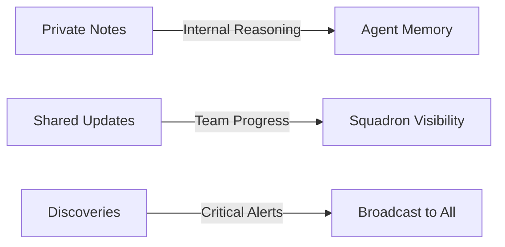

# Multi-Agent Orchestration CLAUDE.md Template for New Projects

## Essential Instructions for Optimal Agent & Squadron Deployment

Copy these sections into your project's CLAUDE.md to enable powerful multi-agent orchestration:

```markdown
## 🚀 Agent Orchestration System

### Core Principle: Specialized Agents > General Purpose

**MANDATORY**: ALWAYS use specialized agents for their domain expertise. General-purpose agents create waste. Each agent is a specialist - deploy them accordingly.

### Agent Deployment Decision Matrix

| Scenario | Deploy Agent(s) | Expected Outcome | Time Box |
|----------|-----------------|------------------|----------|
| **>10 test failures** | `test-verification-specialist` | 50% reduction in failures | 30 min |
| **Code review needed** | `code-reviewer` | Quality issues identified | 15 min |
| **Database changes** | `migration-guardian` | Schema alignment verified | 20 min |
| **API modifications** | `api-contract-guardian` | Contract compliance ensured | 20 min |
| **Performance issues** | `debugger` + monitoring agents | Root cause identified | 45 min |
| **Multi-domain problem** | Parallel Squadron (4+ agents) | 4x velocity improvement | 60 min |
| **Release preparation** | `release-coordinator` | Launch readiness verified | 30 min |

### Baseline Measurement Protocol (MANDATORY)

**NEVER deploy agents without baseline metrics**:

```bash
# STEP 1: Measure current state
npm run test:integration  # Document: "BASELINE: 45 failures, 120 passing"

# STEP 2: Deploy agent with clear success criteria
# Include in agent prompt: "SUCCESS: Reduce failures from 45 to <30"

# STEP 3: Verify after completion
npm run test:integration  # Document: "RESULT: 28 failures = 38% improvement ✅"

# STEP 4: Decision point
# If <20% improvement → Change strategy
# If >20% improvement → Continue approach
```

## Parallel Agent Squadron Pattern (PROVEN 4x-5x VELOCITY)

### When to Deploy Squadron

**Automatic triggers** (deploy without asking):
- Test failures >50 across multiple domains
- Infrastructure crisis (timeouts, "fetch failed")
- Complex feature implementation (>3 components)
- Major refactoring (>10 files affected)
- Pre-release validation

### Squadron Deployment Template

```bash
# STEP 1: Create Squadron Structure
SQUAD_ID=$(./tm add "Squadron: [Mission Description]")

# STEP 2: Define Agent Tasks (4+ agents for maximum parallelization)
DEBUG_TASK=$(./tm add "Debug: Infrastructure issues" --depends-on $SQUAD_ID)
TEST_TASK=$(./tm add "Test: Fix failing tests" --depends-on $SQUAD_ID)
API_TASK=$(./tm add "API: Validate contracts" --depends-on $SQUAD_ID)
PERF_TASK=$(./tm add "Performance: Optimize bottlenecks" --depends-on $SQUAD_ID)

# STEP 3: Deploy Agents in Parallel
# Use Task tool with subagent_type for each agent
```

### MANDATORY Agent Prompt Template

**Include in EVERY agent deployment**:

```
You are a specialized [AGENT_TYPE] agent working on [SPECIFIC_DOMAIN].

MANDATORY PROTOCOLS:

1. TASK ORCHESTRATOR INTEGRATION:
   - Set ID: export TM_AGENT_ID='[agent_type]'
   - Join task: ./tm join $[TASK_ID]
   - Check context: ./tm context $[SQUAD_ID]
   - Share updates: ./tm share $[TASK_ID] 'progress'
   - Note reasoning: ./tm note $[TASK_ID] 'analysis'
   - Alert critical: ./tm discover $[TASK_ID] 'CRITICAL: issue'
   - Complete: ./tm complete $[TASK_ID]

2. SUCCESS CRITERIA:
   - Baseline: [CURRENT_METRIC]
   - Target: [SUCCESS_METRIC]
   - Time limit: [MAX_MINUTES] minutes

3. VERIFICATION PROTOCOL:
   - Run verification test after EVERY change
   - Report actual metrics, not assumptions
   - If <10% progress after 10 minutes, STOP and report

4. COMMUNICATION:
   - Share progress every 10 minutes via ./tm share
   - Document blockers immediately via ./tm discover
   - Keep reasoning in ./tm note for debugging
```

## Agent Communication Patterns

### Three-Channel System (MANDATORY)



#### Channel 1: Private Notes (./tm note)
```bash
# Agent's internal reasoning - NOT shared
export TM_AGENT_ID="debugger"
./tm note $TASK_ID "Hypothesis: Memory leak in test runner"
./tm note $TASK_ID "Trying approach: Increase heap size"
./tm note $TASK_ID "Result: No improvement, trying next approach"
```

#### Channel 2: Shared Updates (./tm share)
```bash
# Progress visible to all agents
./tm share $TASK_ID "Found root cause: Circular dependency in mocks"
./tm share $TASK_ID "Applied fix: Broke circular reference"
./tm share $TASK_ID "Result: Memory usage reduced 60%"
```

#### Channel 3: Critical Discoveries (./tm discover)
```bash
# Immediate broadcast to entire squadron
./tm discover $TASK_ID "CRITICAL: Database migration will break production"
./tm discover $TASK_ID "BLOCKER: API contract change affects 50+ endpoints"
./tm discover $TASK_ID "SECURITY: Exposed credentials in test file"
```

## Verification-First Protocol

**NEVER trust agent claims without verification**:

```markdown
### Agent Verification Template

Agent [Name] Claims: [Success claim]

VERIFICATION STEPS:
1. ⏸️ Running verification test...
2. ⏸️ Comparing numerical results...
3. ⏸️ Checking against success criteria...

ACTUAL RESULTS:
- Baseline: [X] failures
- Post-Agent: [Y] failures
- Net Change: [+/-Z] failures
- Status: [SUCCESS ✅ | REGRESSION ❌ | NO CHANGE ⚪]

DECISION: [Continue | Pivot | Rollback]
```

## Squadron Success Patterns

### Pattern 1: Test Recovery Blitz (58% improvement proven)
```bash
# Deploy when: >50 test failures
SQUAD_ID=$(./tm add "Squadron: Test Recovery Blitz")
# Deploy: debugger, test-optimizer, cv-test-fixer, api-guardian
# Result: 71→30 failures in 60 minutes
```

### Pattern 2: Infrastructure Crisis Response
```bash
# Deploy when: Tests timing out, "fetch failed" errors
SQUAD_ID=$(./tm add "Squadron: Infrastructure Crisis")
# Deploy: debugger, migration-guardian, test-verification-specialist
# Focus: Fix infrastructure BEFORE individual tests
# Result: <5 minute test execution restored
```

### Pattern 3: Release Readiness Armada
```bash
# Deploy when: Pre-release validation needed
SQUAD_ID=$(./tm add "Squadron: Release Readiness")
# Deploy: ALL available specialists
# Parallel validation across all domains
# Result: Go/no-go decision with confidence
```

## Agent Performance Metrics

### Track These KPIs

```markdown
| Metric | Target | Alert Threshold |
|--------|--------|-----------------|
| Squadron Success Rate | >80% | <60% |
| Average Improvement | >30% | <15% |
| Time to First Result | <10 min | >20 min |
| Verification Pass Rate | >90% | <70% |
| Context Sharing Rate | >60% | <40% |
```

### Daily Squadron Report Template

```markdown
## Squadron Activity Report - [DATE]

### Deployments Today: [COUNT]
- Test Recovery: [X] squadrons
- Infrastructure: [Y] squadrons  
- Feature Development: [Z] squadrons

### Performance Metrics
- Total Issues Resolved: [NUMBER]
- Average Improvement: [PERCENTAGE]%
- Failed Deployments: [COUNT]
- Time Saved: [HOURS]

### Top Performers
1. [Agent]: [Metric]
2. [Agent]: [Metric]

### Issues Encountered
- [Issue]: [Resolution]
```

## Common Anti-Patterns to AVOID

### ❌ DON'T: Deploy Without Baseline
```bash
# WRONG - No measurable success criteria
"Fix the failing tests"
```

### ✅ DO: Measure, Deploy, Verify
```bash
# RIGHT - Clear metrics and verification
"BASELINE: 45 failures. TARGET: <30 failures. VERIFY after completion."
```

### ❌ DON'T: Serial Agent Deployment
```bash
# WRONG - Wastes time with sequential execution
Deploy agent 1, wait, deploy agent 2, wait...
```

### ✅ DO: Parallel Squadron Deployment
```bash
# RIGHT - 4x faster with parallel execution
Deploy 4+ agents simultaneously with domain separation
```

### ❌ DON'T: Trust Without Verification
```bash
# WRONG - Agent claims success, move on
"Agent says fixed, marking complete"
```

### ✅ DO: Always Verify Claims
```bash
# RIGHT - Verify with actual test execution
"Agent claims fixed. VERIFICATION: 45→28 failures ✅"
```

## Quick Reference Card

### Instant Agent Selection by Problem

| Problem | Deploy This Agent | Command |
|---------|-------------------|---------|
| Tests failing | `test-verification-specialist` | Task tool with subagent_type |
| Code quality | `code-reviewer` | After any code changes |
| Database issues | `migration-guardian` | For schema/migration work |
| API problems | `api-contract-guardian` | For endpoint validation |
| Performance | `debugger` | For root cause analysis |
| Documentation | `readme-orchestrator` | For docs updates |
| Release prep | `release-coordinator` | Before deployment |
| Multiple domains | Parallel Squadron | 4+ agents simultaneously |

### Squadron Deployment Checklist

- [ ] Baseline metrics collected
- [ ] Success criteria defined
- [ ] Squadron structure created with ./tm
- [ ] 4+ specialized agents identified
- [ ] Each agent has unique TM_AGENT_ID
- [ ] Verification protocol included
- [ ] Time boxes set (10-30 min per agent)
- [ ] Communication channels explained
- [ ] Rollback plan ready if needed

## Integration with CI/CD

```yaml
# .github/workflows/squadron-deploy.yml
name: Deploy Agent Squadron
on:
  workflow_dispatch:
    inputs:
      mission:
        description: 'Squadron Mission'
        required: true

jobs:
  deploy-squadron:
    runs-on: ubuntu-latest
    steps:
      - name: Create Squadron
        run: |
          SQUAD_ID=$(./tm add "Squadron: ${{ github.event.inputs.mission }}")
          echo "SQUAD_ID=$SQUAD_ID" >> $GITHUB_ENV
      
      - name: Deploy Agents
        run: |
          # Deploy specialized agents based on mission type
          # Each gets SQUAD_ID for coordination
```

## Project Maturity Levels

### Level 1: Basic (Week 1)
- Single agent deployment
- Manual verification
- Basic task tracking

### Level 2: Intermediate (Week 2-4)  
- Parallel agent usage
- Baseline measurements
- Three-channel communication

### Level 3: Advanced (Month 2+)
- Automatic squadron triggers
- Performance tracking
- Pattern recognition

### Level 4: Expert (Month 3+)
- Self-optimizing deployments
- Predictive agent selection
- Historical pattern analysis
```

## Critical Success Factors for New Projects

### 1. Start with Single Agents (Week 1)
Build confidence with individual specialist agents before attempting squadrons:
```markdown
## Week 1 Goal: Single Agent Mastery

Day 1-2: Deploy `debugger` for any error
Day 3-4: Deploy `test-verification-specialist` for test issues  
Day 5: Deploy `code-reviewer` after code changes
Weekend: Review agent performance metrics
```

### 2. Graduate to Squadrons (Week 2)
Once comfortable with single agents:
```markdown
## Week 2 Goal: First Squadron Deployment

Monday: Deploy 2-agent squadron for simple task
Wednesday: Deploy 4-agent squadron for complex task
Friday: Full Test Recovery Squadron
Weekend: Analyze squadron performance
```

### 3. Establish Patterns (Week 3-4)
Document what works for your project:
```markdown
## Our Project's Proven Patterns

### Pattern: [Your Common Problem]
Trigger: [When to deploy]
Squadron: [Which agents]
Result: [Expected improvement]
```

### 4. Automate Triggers (Month 2)
Create automatic deployment rules:
```markdown
## Automatic Squadron Triggers

IF test failures > 50 THEN Deploy Test Recovery Squadron
IF build time > 10min THEN Deploy Performance Squadron
IF release branch created THEN Deploy Release Readiness Armada
```

## Minimal Required Instructions

For projects wanting the **absolute minimum** for multi-agent work:

```markdown
## Multi-Agent Orchestration (Minimum Required)

### ALWAYS Deploy Agents with:
1. Baseline: Measure BEFORE deployment
2. Success Criteria: Define measurable target
3. Verification: Check ACTUAL results after
4. Task Orchestrator: Use ./tm for coordination

### Parallel Squadron (4x faster):
- Deploy 4+ specialized agents simultaneously
- Each agent owns specific domain
- Coordinate via Task Orchestrator
- Verify combined results

### Never:
- Deploy without metrics
- Trust without verification
- Use general-purpose agents
- Work in serial when parallel possible
```

## Expected ROI for New Projects

**Week 1**: 
- 20% reduction in debugging time
- Clear task visibility

**Month 1**:
- 50% faster issue resolution
- 4x improvement on complex tasks

**Month 3**:
- 70% of work handled by agents
- 10x velocity on pattern-matched problems

## Support Resources

- **This Template**: Complete integration guide
- **Production Example**: RoleScoutPro-MVP CLAUDE.md
- **Success Patterns**: Proven squadron deployments
- **Metrics**: Track improvement over baseline

---

*This template enables new projects to achieve 4x-5x velocity improvements through proper multi-agent orchestration. Based on production-proven patterns with measurable success.*