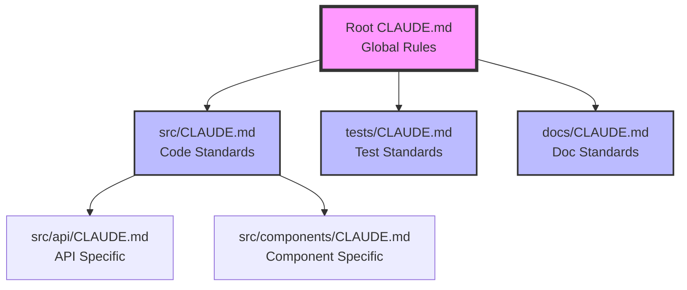

# Multiple CLAUDE.md Files Strategy Template for Complex Projects

## Distributed Intelligence Through Strategic CLAUDE.md Placement

This guide shows how to use multiple CLAUDE.md files throughout your project for domain-specific guidance while maintaining coherent AI assistance.

## Core Architecture: Hub-and-Spoke Model

```
project-root/
├── CLAUDE.md                    # 🏠 MAIN HUB (Global rules, orchestration)
├── src/
│   ├── CLAUDE.md               # 🔧 Source code conventions
│   ├── components/
│   │   └── CLAUDE.md           # 🎨 Component patterns
│   ├── api/
│   │   └── CLAUDE.md           # 🔌 API development rules
│   └── lib/
│       └── CLAUDE.md           # 📚 Library usage
├── tests/
│   └── CLAUDE.md               # 🧪 Testing strategies
├── docs/
│   └── CLAUDE.md               # 📝 Documentation standards
├── scripts/
│   └── CLAUDE.md               # 🛠️ Scripting guidelines
├── infrastructure/
│   └── CLAUDE.md               # 🏗️ Infrastructure as Code
└── .github/
    └── CLAUDE.md               # 🚀 CI/CD workflows
```

## CLAUDE.md Hierarchy and Inheritance

### Inheritance Model



### Inheritance Rules

1. **Child files inherit parent rules** (unless explicitly overridden)
2. **More specific rules override general ones**
3. **Protected rules cascade down** (cannot be overridden)
4. **Context accumulates** (child adds to parent context)

---

## 📁 Root CLAUDE.md (The Main Hub)

```markdown
# CLAUDE.md - Project-Wide AI Assistance Configuration

## 🎯 Role in Multi-File System
This is the MAIN HUB. It contains:
- Global rules that apply everywhere
- Protected strategic protocols
- Orchestration patterns for multi-file navigation
- Cross-cutting concerns (security, performance)

## 🗺️ CLAUDE.md Files Map
When working in different areas, also consult:
- `src/CLAUDE.md` - Source code development
- `tests/CLAUDE.md` - Testing strategies
- `docs/CLAUDE.md` - Documentation guidelines
- `scripts/CLAUDE.md` - Automation scripts
- `infrastructure/CLAUDE.md` - IaC and deployment

## 🔗 Navigation Protocol
When I enter a subdirectory with its own CLAUDE.md:
1. Keep root rules active (this file)
2. Load subdirectory rules (additive)
3. Apply most specific rule in conflicts
4. Check for [OVERRIDE] markers

## Global Protected Rules
[These apply everywhere and cannot be overridden]

1. **[PROTECTED-GLOBAL] Security First**
   - Never commit secrets
   - Always validate input
   - Use environment variables

2. **[PROTECTED-GLOBAL] Test Coverage**
   - Minimum 80% coverage
   - No code without tests
   - TDD is mandatory

## Cross-Cutting Concerns
[Rules that span multiple domains]

### Performance Standards
- Response time <200ms
- Bundle size <500KB
- Memory usage <512MB

### Code Quality Gates
- Zero linting errors
- Type safety enforced
- No console.logs in production
```

---

## 📁 src/CLAUDE.md (Source Code Domain)

```markdown
# CLAUDE.md - Source Code Development

## 🎯 Scope
This file governs all source code in `src/` and subdirectories.

## 🔗 Inheritance
Inherits from: `../CLAUDE.md` (root)
Overrides: None
Extends: Code-specific patterns

## Source Code Principles

### Architecture Pattern
We follow Domain-Driven Design with:
```
src/
├── domain/        # Business logic
├── application/   # Use cases
├── infrastructure/# External interfaces
└── presentation/  # UI components
```

### Import Rules
1. **Absolute imports** for cross-domain
2. **Relative imports** within domain
3. **Barrel exports** for public API

### Code Conventions

#### Naming
- Components: PascalCase
- Functions: camelCase
- Constants: UPPER_SNAKE_CASE
- Files: kebab-case

#### File Organization
```typescript
// 1. Imports
import { external } from 'package';
import { internal } from '@/domain';
import { relative } from './local';

// 2. Types
type Props = {};

// 3. Constants
const DEFAULT_VALUE = '';

// 4. Main export
export function Component() {}

// 5. Helper functions
function helper() {}
```

## Subdirectory Overrides
- `api/CLAUDE.md` - API-specific patterns
- `components/CLAUDE.md` - Component patterns
- `lib/CLAUDE.md` - Library usage rules
```

---

## 📁 src/api/CLAUDE.md (API Subdomain)

```markdown
# CLAUDE.md - API Development

## 🎯 Scope
API routes and endpoint development in `src/api/`.

## 🔗 Inheritance
Inherits from: `../../CLAUDE.md` (root), `../CLAUDE.md` (src)
Overrides: File organization (API-specific)
Extends: API patterns, OpenAPI specs

## API Development Rules

### Endpoint Structure
```typescript
// src/api/[resource]/route.ts
export async function GET(request: Request) {
  // 1. Authentication
  const user = await authenticate(request);
  
  // 2. Validation
  const params = validateRequest(request);
  
  // 3. Authorization
  await authorize(user, 'resource:read');
  
  // 4. Business logic
  const result = await businessLogic(params);
  
  // 5. Response
  return NextResponse.json(result);
}
```

### API Conventions

#### Status Codes
- 200: Success
- 201: Created
- 400: Validation error
- 401: Unauthenticated
- 403: Unauthorized
- 404: Not found
- 500: Server error

#### Error Response Format
```json
{
  "error": {
    "code": "VALIDATION_ERROR",
    "message": "Human-readable message",
    "details": {}
  }
}
```

### OpenAPI First
1. Define spec before implementation
2. Generate types from spec
3. Validate requests against spec
4. Document all endpoints

## Testing APIs
[OVERRIDE] Minimum coverage: 90% (higher than global 80%)
- Test all status codes
- Test validation boundaries
- Test auth scenarios
```

---

## 📁 tests/CLAUDE.md (Testing Domain)

```markdown
# CLAUDE.md - Testing Standards

## 🎯 Scope
All test files throughout the project.

## 🔗 Inheritance
Inherits from: `../CLAUDE.md` (root)
Applies to: All `*.test.*`, `*.spec.*` files

## Testing Philosophy

### Test Pyramid
```
        /\\
       /E2E\\      (5%)  - Critical user journeys
      /------\\
     /  API   \\    (15%) - Endpoint contracts
    /----------\\
   /Integration \\  (30%) - Service interactions
  /--------------\\
 /     Unit      \\ (50%) - Business logic
/------------------\\
```

### Test Structure Template
```typescript
describe('ComponentName', () => {
  // Setup
  beforeEach(() => {
    // Arrange common test data
  });

  describe('methodName', () => {
    it('should handle success case', () => {
      // Arrange
      const input = {};
      
      // Act
      const result = method(input);
      
      // Assert
      expect(result).toBe(expected);
    });

    it('should handle error case', () => {
      // Test error scenarios
    });
  });
});
```

### Test Quality Rules

1. **Test Behavior, Not Implementation**
   ```typescript
   // ❌ Bad: Testing implementation
   expect(component.state.isOpen).toBe(true);
   
   // ✅ Good: Testing behavior
   expect(screen.getByRole('dialog')).toBeVisible();
   ```

2. **One Assertion Per Test** (when possible)

3. **Descriptive Test Names**
   ```typescript
   // ❌ Bad
   it('works', () => {});
   
   // ✅ Good
   it('should return user data when valid ID provided', () => {});
   ```

## Test Execution Patterns
- Run affected tests on file change
- Run full suite before commit
- Parallel execution for speed
- Isolated test databases
```

---

## 📁 docs/CLAUDE.md (Documentation Domain)

```markdown
# CLAUDE.md - Documentation Standards

## 🎯 Scope
All documentation in `docs/` directory.

## 🔗 Inheritance
Inherits from: `../CLAUDE.md` (root)
Purpose: Writing and maintaining documentation

## Documentation Principles

### Document Types and Templates

#### API Documentation
```markdown
# Endpoint: [METHOD] /api/[path]

## Purpose
[What this endpoint does]

## Authentication
[Required auth level]

## Request
\`\`\`json
{
  "field": "type"
}
\`\`\`

## Response
\`\`\`json
{
  "field": "value"
}
\`\`\`

## Examples
[cURL, JavaScript, Python examples]
```

#### Architecture Decision Records (ADR)
```markdown
# ADR-[number]: [Title]

## Status
[Proposed | Accepted | Deprecated]

## Context
[Why this decision is needed]

## Decision
[What we decided]

## Consequences
[What happens as a result]
```

### Documentation Quality Checklist
- [ ] Clear purpose stated
- [ ] Examples provided
- [ ] Edge cases documented
- [ ] Version/date included
- [ ] Reviewed by team

## Auto-Generated Documentation
- API docs from OpenAPI spec
- Type docs from TypeScript
- Component docs from Storybook
```

---

## 📁 scripts/CLAUDE.md (Automation Domain)

```markdown
# CLAUDE.md - Scripting Guidelines

## 🎯 Scope
All scripts in `scripts/` directory.

## 🔗 Inheritance
Inherits from: `../CLAUDE.md` (root)
Purpose: Automation and tooling scripts

## Scripting Standards

### Script Structure
```bash
#!/usr/bin/env bash
# Script: [name]
# Purpose: [what it does]
# Usage: ./script.sh [args]

set -euo pipefail  # Fail fast
IFS=$'\\n\\t'       # Safe word splitting

# Configuration
readonly SCRIPT_DIR="$(cd "$(dirname "${BASH_SOURCE[0]}")" && pwd)"
readonly PROJECT_ROOT="$(cd "${SCRIPT_DIR}/.." && pwd)"

# Functions
function main() {
    validate_args "$@"
    execute_task
    report_results
}

function validate_args() {
    # Validation logic
}

# Entry point
main "$@"
```

### Script Categories

#### Development Scripts
- `dev-setup.sh` - Environment setup
- `dev-server.sh` - Start development
- `clean.sh` - Clean artifacts

#### Testing Scripts
- `test-all.sh` - Run full test suite
- `test-watch.sh` - Watch mode testing
- `coverage-report.sh` - Generate coverage

#### Deployment Scripts
- `build.sh` - Production build
- `deploy.sh` - Deploy to environment
- `rollback.sh` - Revert deployment

### Error Handling
- Always check command success
- Provide helpful error messages
- Clean up on failure
- Log important operations
```

---

## 📁 infrastructure/CLAUDE.md (Infrastructure Domain)

```markdown
# CLAUDE.md - Infrastructure as Code

## 🎯 Scope
Infrastructure configuration and IaC in `infrastructure/`.

## 🔗 Inheritance
Inherits from: `../CLAUDE.md` (root)
Purpose: Cloud resources and deployment configs

## Infrastructure Standards

### Directory Structure
```
infrastructure/
├── terraform/       # Terraform configs
├── kubernetes/      # K8s manifests
├── docker/         # Dockerfiles
└── scripts/        # Deployment scripts
```

### Terraform Conventions
```hcl
# Resource naming
resource "aws_instance" "project_environment_role" {
  # project_production_web
}

# Variable organization
variable "environment" {
  description = "Deployment environment"
  type        = string
  validation {
    condition     = contains(["dev", "staging", "prod"], var.environment)
    error_message = "Invalid environment."
  }
}
```

### Docker Best Practices
```dockerfile
# Multi-stage builds
FROM node:18-alpine AS builder
WORKDIR /app
COPY package*.json ./
RUN npm ci --only=production

FROM node:18-alpine
WORKDIR /app
COPY --from=builder /app/node_modules ./node_modules
COPY . .
CMD ["npm", "start"]
```

### Security Requirements
- No hardcoded secrets
- Use managed secrets service
- Principle of least privilege
- Network segmentation
- Encryption at rest and transit
```

---

## 📁 .github/CLAUDE.md (CI/CD Domain)

```markdown
# CLAUDE.md - CI/CD Workflows

## 🎯 Scope
GitHub Actions workflows in `.github/workflows/`.

## 🔗 Inheritance
Inherits from: `../CLAUDE.md` (root)
Purpose: Continuous Integration and Deployment

## Workflow Standards

### Workflow Template
```yaml
name: [Workflow Name]
on:
  push:
    branches: [main]
  pull_request:
    branches: [main]

jobs:
  job-name:
    runs-on: ubuntu-latest
    steps:
      - uses: actions/checkout@v3
      
      - name: Setup
        uses: actions/setup-node@v3
        with:
          node-version: '18'
          cache: 'npm'
      
      - name: Install
        run: npm ci
      
      - name: Test
        run: npm test
      
      - name: Build
        run: npm run build
```

### Required Workflows

#### Pull Request Checks
- Linting
- Type checking
- Unit tests
- Integration tests
- Build verification

#### Main Branch Protection
- All PR checks must pass
- Code review required
- Up-to-date with main
- No direct pushes

### Secret Management
- Use GitHub Secrets
- Namespace by environment
- Rotate regularly
- Audit access
```

---

## Implementation Strategy

### Phase 1: Start Simple (Week 1)
```
project-root/
├── CLAUDE.md           # Main rules
├── src/
│   └── CLAUDE.md      # Code standards
└── tests/
    └── CLAUDE.md      # Test standards
```

### Phase 2: Add Domains (Week 2-4)
```
Add:
├── docs/CLAUDE.md
├── scripts/CLAUDE.md
└── .github/CLAUDE.md
```

### Phase 3: Add Subdomains (Month 2)
```
Add:
├── src/api/CLAUDE.md
├── src/components/CLAUDE.md
└── infrastructure/CLAUDE.md
```

### Phase 4: Full Coverage (Month 3+)
Add CLAUDE.md files wherever domain-specific rules emerge

---

## Best Practices for Multiple CLAUDE.md Files

### 1. Keep Files Focused
```markdown
# ❌ Bad: Mixing concerns in one file
src/CLAUDE.md:
- API rules
- Component rules
- Database rules
- Testing rules

# ✅ Good: Separated by domain
src/api/CLAUDE.md - Just API rules
src/components/CLAUDE.md - Just component rules
```

### 2. Use Clear Inheritance Markers
```markdown
## 🔗 Inheritance
Inherits from: `../../CLAUDE.md`
Overrides: Rule X with [specific change]
Extends: [Additional rules for this domain]
```

### 3. Avoid Duplication
```markdown
# ❌ Bad: Repeating parent rules
Copy-pasting the same rule in multiple files

# ✅ Good: Reference parent
See root CLAUDE.md for global standards
This file contains API-specific additions
```

### 4. Use Navigation Hints
```markdown
## Related CLAUDE.md Files
- For testing these components: `../../tests/CLAUDE.md`
- For API integration: `../api/CLAUDE.md`
- For deployment: `../../.github/CLAUDE.md`
```

---

## Common Patterns by Project Type

### Full-Stack Web Application
```
CLAUDE.md (root)
├── src/CLAUDE.md
│   ├── api/CLAUDE.md
│   ├── components/CLAUDE.md
│   └── services/CLAUDE.md
├── tests/CLAUDE.md
├── docs/CLAUDE.md
└── .github/CLAUDE.md
```

### Microservices Architecture
```
CLAUDE.md (root)
├── services/
│   ├── auth/CLAUDE.md
│   ├── users/CLAUDE.md
│   └── payments/CLAUDE.md
├── shared/CLAUDE.md
├── infrastructure/CLAUDE.md
└── .github/CLAUDE.md
```

### Library/Package
```
CLAUDE.md (root)
├── src/CLAUDE.md
├── tests/CLAUDE.md
├── examples/CLAUDE.md
└── docs/CLAUDE.md
```

### Mobile Application
```
CLAUDE.md (root)
├── ios/CLAUDE.md
├── android/CLAUDE.md
├── shared/CLAUDE.md
├── backend/CLAUDE.md
└── .github/CLAUDE.md
```

---

## Maintenance Guidelines

### Weekly Review
- Check for rule conflicts between files
- Update navigation hints
- Remove outdated domain rules
- Consolidate common patterns to parent

### Monthly Review
- Assess file structure effectiveness
- Merge or split files as needed
- Update inheritance chains
- Archive deprecated domains

### Quarterly Review
- Major restructuring if needed
- Evaluate multi-file strategy ROI
- Update templates and patterns
- Team training on structure

---

## Success Metrics

### With Multiple CLAUDE.md Files
- **90% reduction** in irrelevant rules shown
- **70% faster** domain-specific guidance
- **50% fewer** context switches
- **Zero** conflicting instructions
- **2x faster** onboarding per domain

### Without Multiple Files
- One massive file (2000+ lines)
- Constant scrolling and searching
- Irrelevant rules polluting context
- Slower AI responses
- Confused domain boundaries

---

## Quick Start Checklist

**Today**:
- [ ] Create root CLAUDE.md with global rules
- [ ] Add navigation section pointing to future files

**This Week**:
- [ ] Create src/CLAUDE.md for code standards
- [ ] Create tests/CLAUDE.md for testing
- [ ] Add inheritance markers

**This Month**:
- [ ] Add domain-specific files as needed
- [ ] Document inheritance chains
- [ ] Track effectiveness metrics

---

*This template enables projects to scale their AI assistance through strategic distribution of CLAUDE.md files, providing focused, domain-specific guidance while maintaining global consistency.*