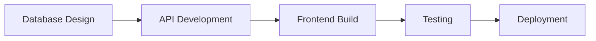
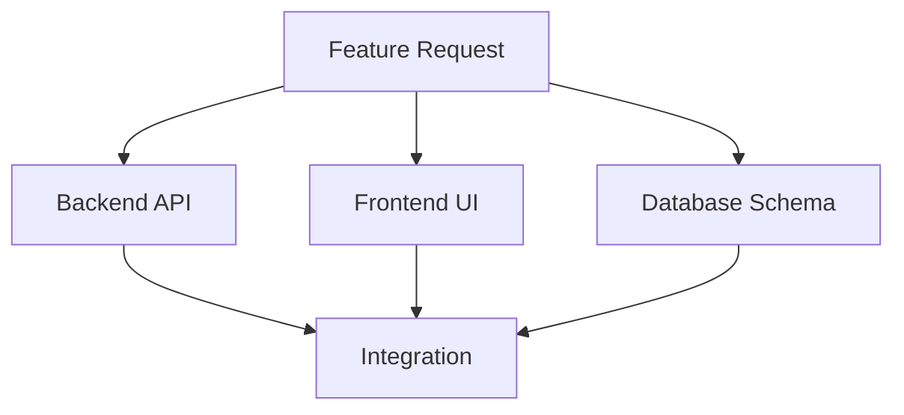
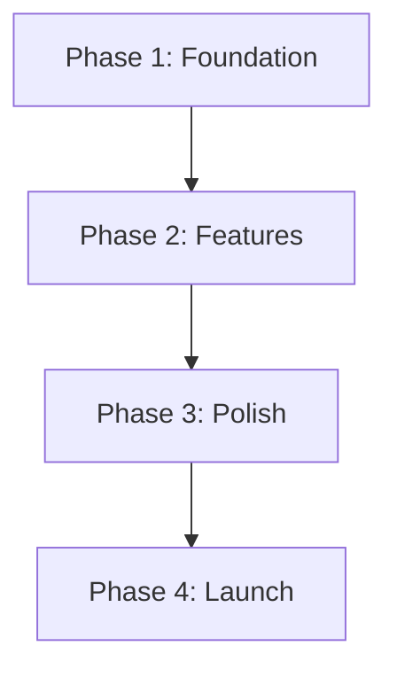

# Multi-Agent Architecture with Task Orchestrator

## Overview

Task Orchestrator enables sophisticated multi-agent collaboration where an orchestrator coordinates specialized sub-agents working on complex projects. This document explains the architecture, communication patterns, and best practices.

## 🏗️ System Architecture

```
┌─────────────────────────────────────────────────────────┐
│                   ORCHESTRATOR AGENT                     │
│                                                          │
│  • Creates project structure                            │
│  • Assigns tasks to specialists                         │
│  • Monitors progress                                    │
│  • Handles blockers                                     │
└────────────────┬────────────────────────────────────────┘
                 │
                 ├──────────────┬──────────────┬──────────────┐
                 ▼              ▼              ▼              ▼
        ┌──────────────┐ ┌──────────────┐ ┌──────────────┐ ┌──────────────┐
        │ DB Specialist│ │Backend Spec. │ │Frontend Spec.│ │ QA Specialist│
        ├──────────────┤ ├──────────────┤ ├──────────────┤ ├──────────────┤
        │ • Schema     │ │ • APIs       │ │ • UI         │ │ • Testing    │
        │ • Migrations │ │ • Services   │ │ • UX         │ │ • Security   │
        │ • Indexes    │ │ • Auth       │ │ • State      │ │ • Performance│
        └──────────────┘ └──────────────┘ └──────────────┘ └──────────────┘
                 │              │              │              │
                 └──────────────┴──────────────┴──────────────┘
                                       │
                            ┌──────────▼──────────┐
                            │   Shared Context    │
                            │   (.task-orchestrator)│
                            └─────────────────────┘
```

## 💬 Three-Channel Communication System

### 1. Private Notes (Agent's Internal Thoughts)
```bash
./tm note task_id "Considering different approaches..."
```
- **Visibility**: Only the agent who wrote it
- **Purpose**: Research, reasoning, personal reminders
- **Storage**: `.task-orchestrator/notes/notes_[task]_[agent].md`

### 2. Shared Updates (Team Communication)
```bash
./tm share task_id "Database schema complete, ready for API development"
```
- **Visibility**: All agents working on the project
- **Purpose**: Progress updates, handoffs, decisions
- **Storage**: `.task-orchestrator/contexts/context_[task]_[agent].md`

### 3. Discoveries (Critical Alerts)
```bash
./tm discover task_id "CRITICAL: Security vulnerability found in dependency"
```
- **Visibility**: All agents (high priority notification)
- **Purpose**: Blockers, breakthroughs, urgent issues
- **Storage**: Shared context with priority flag

## 🔄 Collaboration Workflows

### Sequential Workflow
Tasks flow from one specialist to another:



### Parallel Workflow
Multiple specialists work simultaneously:



### Phased Workflow
Work organized in phases with checkpoints:



## 📁 Data Structure

```
.task-orchestrator/
├── tasks.db                              # Shared task database
├── contexts/                              # Team communication
│   ├── context_task001_orchestrator.md   # Orchestrator's updates
│   ├── context_task001_db_specialist.md  # DB specialist's updates
│   └── context_task001_backend_spec.md   # Backend's updates
├── notes/                                 # Private agent notes
│   ├── notes_task001_db_specialist.md    # DB's private thoughts
│   └── notes_task001_backend_spec.md     # Backend's private thoughts
└── archives/                              # Completed tasks
    └── archive_[timestamp]_task001.tar.gz
```

## 🎯 Key Features for Multi-Agent Work

### 1. Task Dependencies
Ensures correct execution order:
```bash
DB_TASK=$(./tm add "Create schema")
API_TASK=$(./tm add "Build API" --depends-on $DB_TASK)
```

### 2. Agent Assignment
Direct task routing to specialists:
```bash
./tm add "Optimize queries" --assignee db_specialist
./tm add "Create endpoints" --assignee backend_specialist
```

### 3. Real-time Monitoring
Orchestrator tracks all progress:
```bash
./tm watch  # See updates as they happen
./tm list --status blocked  # Find bottlenecks
```

### 4. Context Preservation
All communication persists across sessions:
```bash
./tm context task_id  # View complete history
```

## 🚀 Example: Complete Feature Implementation

### Step 1: Orchestrator Creates Structure
```bash
export TM_AGENT_ID="orchestrator"

# Main feature
FEATURE=$(./tm add "User Profile Feature" -p high)

# Assign to specialists
./tm add "Profile schema" --depends-on $FEATURE --assignee db_specialist
./tm add "Profile API" --depends-on $FEATURE --assignee backend_specialist  
./tm add "Profile UI" --depends-on $FEATURE --assignee frontend_specialist

# Share requirements
./tm share $FEATURE "Requirements: Avatar upload, bio, social links"
```

### Step 2: DB Specialist Works
```bash
export TM_AGENT_ID="db_specialist"

# Join and work
./tm join task_profile_schema
./tm note task_profile_schema "Considering JSON vs separate tables"
./tm share task_profile_schema "Schema ready: users_profiles table created"
./tm complete task_profile_schema
```

### Step 3: Backend Specialist Continues
```bash
export TM_AGENT_ID="backend_specialist"

# See DB work
./tm context task_profile_schema

# Build on it
./tm join task_profile_api
./tm share task_profile_api "Endpoints ready: GET/PUT /api/profile"
./tm discover task_profile_api "Added image upload to S3"
```

### Step 4: Frontend Integrates
```bash
export TM_AGENT_ID="frontend_specialist"

# Check API details
./tm context task_profile_api

# Build UI
./tm join task_profile_ui
./tm share task_profile_ui "Profile component complete with S3 upload"
```

## 📊 Benefits of This Architecture

### For Orchestrators
- Clear project overview
- Easy task delegation  
- Real-time progress tracking
- Blocker identification

### For Specialists
- Focused work areas
- Clear requirements
- Preserved context
- Asynchronous collaboration

### For Projects
- Parallel development
- Reduced miscommunication
- Audit trail
- Knowledge preservation

## 🔧 Best Practices

### 1. Clear Communication Hierarchy
- **Notes**: Internal reasoning
- **Share**: Team updates
- **Discover**: Critical information
- **Sync**: Coordination points

### 2. Proper Task Granularity
- Tasks should be 2-8 hours of work
- Clear definition of "done"
- Single responsibility per task

### 3. Effective Dependencies
- Identify true dependencies
- Avoid unnecessary blocking
- Use parallel paths when possible

### 4. Regular Synchronization
- Daily status checks
- Weekly phase reviews
- Milestone celebrations

## 🎓 Advanced Patterns

### Load Balancing
```bash
# Find least busy specialist
for specialist in db backend frontend; do
    load=$(./tm list --assignee ${specialist}_specialist --status in_progress | wc -l)
    echo "$specialist: $load tasks"
done
```

### Automatic Escalation
```bash
# Monitor for blockers
while true; do
    blocked=$(./tm list --status blocked)
    if [ -n "$blocked" ]; then
        ./tm share $EPIC "ESCALATION: Blocked tasks need attention"
    fi
    sleep 300
done
```

### Cross-Team Sync
```bash
# Create sync points
./tm sync $PROJECT "SYNC_POINT: All teams check integration"
./tm sync $PROJECT "MILESTONE: Ready for testing"
```

## 📚 Related Documentation

- [Orchestrator Guide](ORCHESTRATOR-GUIDE.md) - Detailed orchestrator instructions
- [QuickStart Guide](QUICKSTART-CLAUDE-CODE.md) - Getting started quickly
- [API Reference](../reference/API_REFERENCE.md) - Complete command reference
- [Examples](../examples/multi_agent_workflow.py) - Code examples

## Summary

Task Orchestrator's multi-agent architecture enables:
- **Structured collaboration** through clear task hierarchies
- **Preserved knowledge** via persistent contexts
- **Flexible communication** with three distinct channels
- **Scalable coordination** for teams of any size

This architecture has been designed specifically for AI agents working together, but works equally well for human teams or mixed human-AI collaboration.