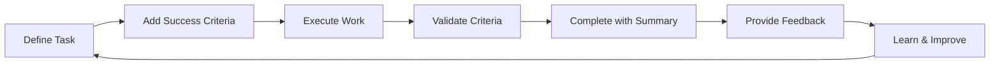

# Core Loop Requirements Summary

## What We're Building (39 Requirements)

### Critical Requirements (Must Have)
1. **FR-027 to FR-028**: Foundation schema extensions (5 new optional fields)
2. **FR-029 to FR-030**: Success criteria definition and validation
3. **FR-032**: Completion summaries for knowledge capture
4. **FR-033**: Simple feedback scores (quality & timeliness)
5. **FR-036**: Anonymous usage telemetry
6. **FR-039**: Safe migration and rollback capability
7. **SR-001 to SR-003**: Strategic mandates (backward compatibility, progressive enhancement, data-driven)

### What We're NOT Building (6 Explicit Exclusions)
1. **EX-001**: No complex review workflows
2. **EX-002**: No formal evaluation gates
3. **EX-003**: No understanding confirmation ceremonies
4. **EX-004**: No elaborate dashboards
5. **EX-005**: No rigid task templates
6. **EX-006**: No team retrospective tools

## The Core Loop



## Key Design Decisions

### 1. Optional Everything
- All new fields are optional
- All new features can be disabled
- Existing workflows unchanged
- Complexity is opt-in

### 2. Data Before Features
- Telemetry from day 1
- 30-day assessment gate
- Build what users pull
- No speculative features

### 3. Simplicity First
- Text commands only
- No UI/dashboards
- Maximum 3 scores
- Templates emerge from usage

## Implementation Timeline

### Week 1: Foundation
- Add 5 database fields (no behavior change)
- Implement telemetry
- Create migration system

### Weeks 2-3: Success Criteria
- Define criteria at task creation
- Validate criteria at completion
- Capture completion summaries

### Week 4: Feedback
- Add simple scoring command
- Basic metrics aggregation
- Configuration options

### Week 5: Assessment
- Generate 30-day report
- Analyze adoption patterns
- Decision gate for future

## Success Metrics

### Must Achieve
- 50%+ success criteria adoption
- 40%+ feedback coverage
- 20%+ rework reduction
- Zero breaking changes

### Nice to Have
- 60%+ completion summaries
- Template pattern emergence
- Positive user feedback
- Feature requests for Phase 4

## Risk Mitigations

### Technical
- Automatic backups before migration
- Full rollback capability
- All fields indexed for performance
- Transaction atomicity maintained

### Adoption
- Everything optional
- Progressive disclosure
- Clear value proposition
- Escape hatches provided

## Command Examples

### New Minimal Usage
```bash
# Just add success criteria
tm add "Build auth" --criteria '[{"criterion": "OAuth2 works", "measurable": "returns 200"}]'

# Complete with validation
tm complete abc123 --validate --summary "OAuth2 implemented"

# Provide feedback
tm feedback abc123 --quality 4
```

### Existing Usage (Still Works)
```bash
# Current commands unchanged
tm add "Build auth"
tm complete abc123
tm list
tm show abc123
```

## Decision Required

### Default Telemetry Setting
**Option A**: Opt-in (telemetry disabled by default)
- Pro: Privacy-first approach
- Con: Less data for decisions

**Option B**: Opt-out (telemetry enabled by default)
- Pro: Better data collection
- Con: May surprise users

**Recommendation**: Option A (opt-in) with prominent prompt on first use

## Next Steps

1. Review and approve PRD-CORE-LOOP-v2.3.md
2. Decide on telemetry default
3. Begin Week 1 implementation
4. Create migration scripts
5. Update documentation

## Files Created

1. `/docs/guides/task-delegation-framework.md` - Original conceptual framework
2. `/docs/reference/gap-analysis-task-delegation-framework.md` - Comprehensive gap analysis
3. `/docs/reference/core-loop-implementation-strategy.md` - Approved implementation strategy
4. `/docs/specifications/requirements/PRD-CORE-LOOP-v2.3.md` - Detailed requirements document
5. `/docs/reference/core-loop-requirements-summary.md` - This summary

---

*Created: 2025-08-20*
*Status: Ready for Implementation*
*Decision Gate: Day 30 after Phase 2*